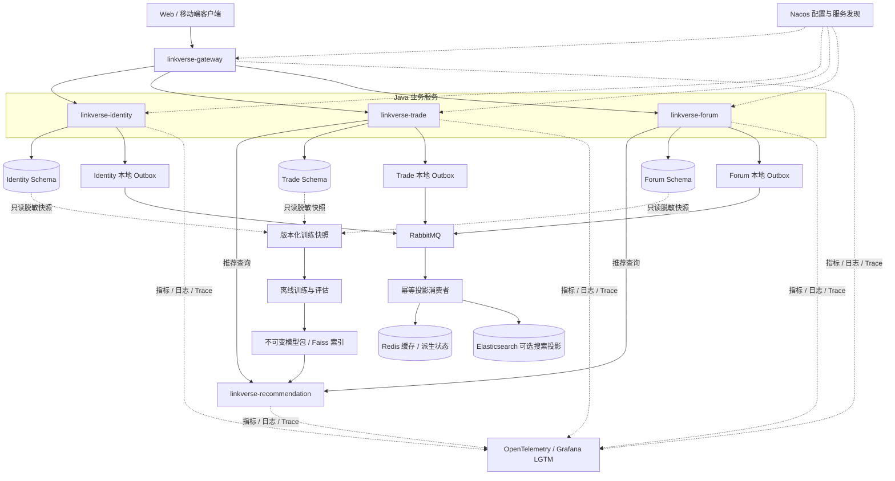

# LinkVerse / 知链空间

LinkVerse 是一个围绕图书交易、知识社区和双域推荐构建的智能微服务平台。系统目标不是在旧工程上继续修补，而是在严格隔离旧快照的前提下，重新建立可验证、可观测、可迁移和可回滚的新平台。

> 当前求职 MVP 已完成阶段 1 基础框架与本地中间件的可复现验证，并通过阶段 2 最小认证/安全的自动化测试与 HTTP 黑盒 E2E。Trade/Payment 业务链路、Forum、Recommendation 和前端仍不在当前可交付范围，不能将本地 MVP 视为可上线系统。

## 1. 项目目标

LinkVerse 的首个稳定版本聚焦以下能力：

- 统一账号、认证、用户资料与关注关系；
- 图书发布、购物车、库存、订单、支付与按需启用的秒杀；
- 帖子、评论、点赞、收藏、举报与内容检索；
- 融合交易和论坛行为的召回、粗排、精排、重排推荐链路；
- 基于日志、指标和分布式追踪的全链路可观测性；
- 新旧数据可校验迁移、灰度切换和有状态写入后的安全恢复。

实时聊天不属于新系统范围。旧 Java/Python 工程只作为行为、契约和算法问题的只读参考，不参与新系统构建或运行。

## 2. 当前实现状态

| 区域 | 当前状态 | 已具备能力 | 尚未包含 |
|---|---|---|---|
| Java 后端 | MVP 阶段 1～2 实现已通过全量构建与 HTTP 黑盒 E2E | 扁平 Maven Reactor、BOM、`platform-core` 与四个 `platform-starter-*`、Gateway/Identity/Trade/Payment 入口、Nacos 服务发现、Gateway 路由和阶段 2 安全闭环 | Trade/Payment 领域业务和生产部署 |
| 本地基础设施 | 运行态验证通过 | MySQL、Redis、RabbitMQ、Nacos 四容器 healthy；三个 Schema/六账号隔离；Nacos runtime 权限和四服务注册；精确 `tag@digest`；bootstrap/verify 重放通过 | 生产高可用、外部密钥系统和真实业务数据 |
| Forum 与 Recommendation | 长期规划，MVP 延期 | 长期边界与数据权限已在设计文档保留 | 当前仓库不包含可构建的 Forum 或 Python Recommendation 工程 |
| 前端与数据迁移 | 延期 | 长期路线和边界已定义 | 当前仓库不包含前端、旧数据迁移工具或切换流程 |

2026-08-19 的可复现证据为：JDK `21.0.12`、Maven Wrapper `3.9.10` 环境下，在线与离线 `clean verify` 均通过 `84` 个测试，`0` failure、`0` error、`0` skipped，其中 Identity 的 `2` 个 MySQL `8.4.11` Testcontainers 用例在两次构建中均实际运行；四个中间件均 healthy；六个数据库账号只能访问所属 Schema，跨 Schema 访问被拒绝；Nacos 中四个 Java 服务各有 `1` 个 healthy 实例。HTTP 黑盒 E2E 的逐项证据以[阶段 1 与阶段 2 验收记录](docs/05-MVP阶段1与阶段2验收记录.md)为准。

## 3. 目标整体架构

本节描述长期稳定版本：Gateway、Identity、Trade、Forum 和 Python Recommendation 五个部署单元。当前求职 MVP 以 Gateway、Identity、Trade、Payment 四个 Java 单元覆盖该蓝图，Forum 与 Recommendation 延期，Payment 暂时独立且独占 Schema。Payment 是否保留为长期单元必须通过后续 ADR 决定，不能从当前 MVP 直接推导。日志、错误处理和追踪以共享 Starter/基础包实现，不额外建设同步调用的 `logger-service` 或 `error-service`。



### 3.1 服务职责

| 服务 | 主要职责 | 明确不负责 |
|---|---|---|
| `linkverse-gateway` | 统一入口、路由、CORS、请求限制、粗粒度认证、限流、灰度标记、请求 ID 和追踪传播 | 业务编排、库存判断和订单状态迁移 |
| `linkverse-identity` | 账号、OAuth2/OIDC、用户资料、关注关系和令牌生命周期 | 交易、论坛内容和推荐模型 |
| `linkverse-trade` | 商品、购物车、库存、订单、支付、退款和按门槛启用的秒杀 | 直接写 Identity/Forum 数据或信任客户端支付结果 |
| `linkverse-forum` | 帖子、评论、互动、举报、计数与内容检索 | 实时聊天、跨服务直接写表和把 ES 当作事实源 |
| `linkverse-recommendation` | 只读快照、离线训练、版本化模型包和在线推荐推断 | 写 MySQL、Redis、ES，或替代 Java 服务完成可见性和可售性过滤 |

### 3.2 数据所有权与一致性

- **MySQL 是唯一业务事实源。** Identity、Trade、Forum 分别拥有独立 Schema 和账号，禁止跨服务直接写表或使用跨 Schema Join 代替契约。
- **Redis 是辅助设施。** 用于缓存、限流、令牌状态、幂等窗口、热点和秒杀准入，不保存最终订单、库存或支付事实。
- **Elasticsearch 是可选投影。** 只有全文检索或相关性需求经过数据验证后才启用，索引必须能够从 MySQL 事实全量重建。
- **RabbitMQ 是唯一消息代理。** 业务数据与 Outbox 在同一 MySQL 本地事务提交，随后以至少一次投递、发布确认、幂等消费、有限重试和补偿完成异步协作。
- **推荐数据默认只读。** Java 服务生成匿名化、版本化训练快照；Python 加载快照和模型推断，Java 仍负责权限、内容可见性、商品可售性和最终业务过滤。

## 4. 技术基线

| 层级 | 当前基线或目标选择 | 说明 |
|---|---|---|
| Java | Java 21；本次验证 `21.0.12` | Maven 编译目标和已验证运行环境 |
| 构建 | Maven Wrapper 3.9.10 | `clean verify` 已在线通过，核心版本由 BOM 管理 |
| 应用框架 | Spring Boot 3.5.15 | 当前 BOM 已采用 |
| 微服务 | Spring Cloud 2025.0.3、Spring Cloud Alibaba 2025.0.0.0 | Gateway、Nacos 配置与服务发现 |
| Python 与推荐 | Python 3.12、FastAPI、PyTorch、Faiss（长期目标） | MVP 延期；当前仓库没有可构建的 Python 工程或锁文件 |
| 数据与消息 | MySQL `8.4.11`、Redis `8.2.8`、RabbitMQ `4.3.4-management` | 已以精确 `tag@digest` 启动并通过运行态验证 |
| 搜索 | Elasticsearch（长期按需） | MVP 未引入镜像、profile 或业务路径 |
| 可观测 | Micrometer 与 `platform-starter-observability` | 当前实现基础观测与脱敏边界；完整 OpenTelemetry/Grafana 栈属于后续工作 |
| 前端 | 待批准设计与版本化契约后确定 | 阶段 8 设计、阶段 9 实现 |

## 5. 仓库结构

```text
LinkVerse/
├─ linkverse-platform/                 # 唯一的新系统代码根目录
│  ├─ backend/                         # 扁平 Java Reactor：BOM、core、四个 Starter、四个 Java 服务
│  ├─ infrastructure/                  # 隔离的 MySQL、Redis、RabbitMQ、Nacos Compose
│  ├─ scripts/                         # 本地秘密准备、幂等 bootstrap 与 verify
│  └─ README.md                        # MVP 边界与验证入口
├─ docs/                               # 中文规划、技术和业务文档
├─ .agents/                            # 项目治理技能
├─ KnowledgeLink-backend/              # 只读旧 Java 快照
└─ KnowledgeLink-RecommenderSystem/    # 只读旧 Python 快照
```

所有新运行时代码、测试、配置和部署文件只能进入 `linkverse-platform/`。两个旧快照由 `.gitignore` 隔离，禁止修改、构建、部署、导入或成为新系统运行时依赖。

## 6. 本地验证入口

### 6.1 Java 后端

```powershell
cd linkverse-platform/backend
.\mvnw.cmd clean verify
```

2026-08-19 该命令及其离线形式 `./mvnw.cmd -o clean verify` 在 JDK `21.0.12` 和 Maven `3.9.10` 下均 BUILD SUCCESS：`84` 个测试，`0` failure、`0` error、`0` skipped；两次均包含 `2` 个真实运行的 Identity MySQL `8.4.11` Testcontainers 用例。

### 6.2 本地基础设施

在 `linkverse-platform/` 执行：

```powershell
cd linkverse-platform
.\scripts\prepare-local.ps1
.\scripts\bootstrap.ps1
.\scripts\verify.ps1
```

当前已验证四个中间件 healthy、三个 Schema/六个账号的正向与越权拒绝、RabbitMQ vhost、Nacos namespace/runtime 权限、四服务注册及 bootstrap/verify 二次重放。真实 `.env`、密钥、生产数据和旧系统凭据不得提交。具体变量和端口见[本地基础设施说明](linkverse-platform/infrastructure/README.md)。

### 6.3 E2E 状态

阶段 2 HTTP 黑盒 E2E 已通过，覆盖注册、登录、用户/服务 JWT 档案、Gateway 与资源服务验签、Payment internal 隔离、CORS、请求 ID、Problem Details、Trace 传播和日志脱敏。真实响应与当前 Provider 回调 fail-closed 边界见[阶段 1 与阶段 2 验收记录](docs/05-MVP阶段1与阶段2验收记录.md)。

## 7. 长期建设路线

下表是稳定版本的长期路线。当前求职 MVP 的阶段 1～2 以 `docs/04-MVP开发步骤与注意事项.md` 为覆盖层，不代表 Forum 或 Recommendation 已实现。

| 阶段 | 目标 |
|---:|---|
| 0 | 新旧隔离、快照基线、安全处置和环境命名 |
| 1 | Java/Python 基础框架、依赖锁定、Nacos、Gateway 与本地 Compose |
| 2 | OAuth2/OIDC、安全错误、请求 ID、结构化日志与 OpenTelemetry |
| 3 | 商品、购物车、库存、订单、正式支付和按需秒杀 |
| 4 | 帖子、评论、互动、计数与按需全文检索 |
| 5 | 统一行为事件、训练快照和受控历史数据转换 |
| 6–7 | 模型训练、离线评估、版本化发布和推荐微服务联调 |
| 8–9 | 前端设计评审与前端实现 |
| 10 | 全链路测试、数据对账、灰度切换和故障恢复 |

任一阶段未通过构建、测试、安全、一致性、可观测和回滚门禁，都不得并行进入依赖它的下一阶段。

## 8. 关键约束

- 不恢复实时聊天服务；
- 不引入 Swagger、Knife4j 或自动暴露的测试 API 文档；
- 不新增同步网络 `logger-service` 或 `error-service`；
- 不把 Redis、Elasticsearch 或推荐模型当作业务事实源；
- 不宣称消息 exactly-once，以幂等键、条件更新、Outbox 和对账保证最终正确性；
- 不将密码、令牌、支付原文、生产数据或私有地址写入 Git、Nacos 明文和日志；
- 不在新旧系统间建立长期双写；历史数据只通过可重复、可对账的一次性迁移进入新 Schema。

## 9. 进一步阅读

- [独立重建与分阶段规划](docs/01-重构规划.md)
- [技术选型与中间件决策](docs/02-技术选型.md)
- [业务边界、一致性与数据规范](docs/03-业务规范.md)
- [MVP 开发步骤与注意事项](docs/04-MVP开发步骤与注意事项.md)
- [MVP 阶段 1 与阶段 2 验收记录](docs/05-MVP阶段1与阶段2验收记录.md)
- [MVP 独立 Payment 服务边界](docs/adr/0001-MVP独立Payment服务边界.md)
- [新平台目录边界](linkverse-platform/README.md)
