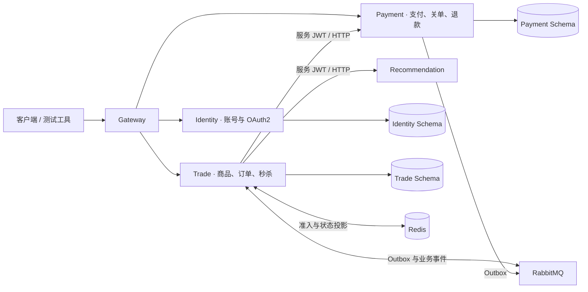
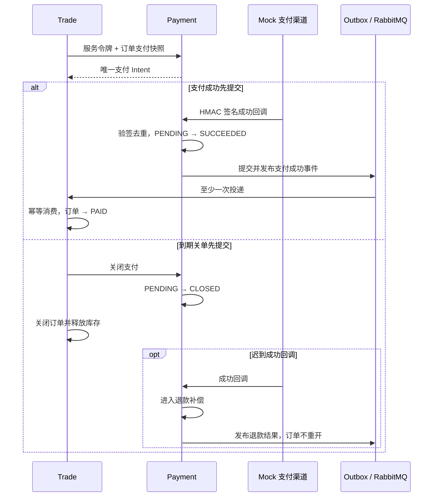
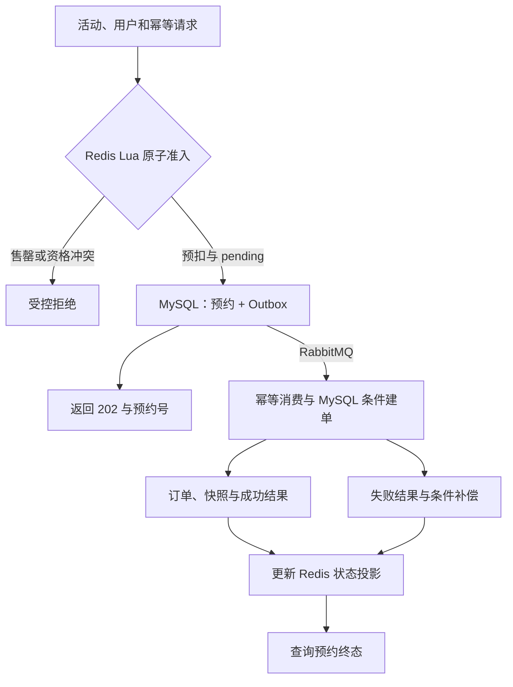
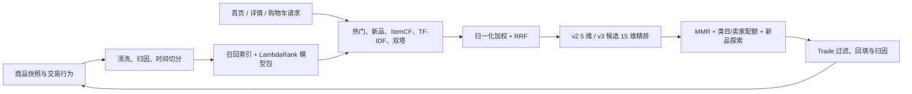

# LinkVerse · 知链空间

面向校园学风建设场景的学习交流与二手书交易项目，项目历程覆盖账号与身份、论坛交流、商品交易、订单支付、即时聊天和个性化推荐等能力，先后经历“单体服务 → 微服务拆分与推荐接入 → 交易可靠性与推荐训练升级”三次演进。

当前仓库承载第三阶段的已完成部分，运行代码集中在 `linkverse-platform/`，形成 Gateway、Identity、Trade、Payment、Recommendation 五个可独立部署单元。论坛、聊天与 Vue 前端将基于历史实现继续整合。

[目录结构](#目录结构) · [项目沿革](#项目沿革与来源) · [功能概览](#功能概览) · [技术架构](#技术架构) · [核心设计](#核心设计) · [推荐系统](#推荐系统) · [迭代与成果](#迭代与成果) · [运行与测试](#运行与测试) · [后续引入](#后续引入与改进) · [贡献者](#贡献者)

## 目录结构

```text
LinkVerse/
├─ README.md
├─ guide/                         # 面向读者的架构、业务与验证专题
├─ linkverse-platform/
│  ├─ backend/                   # Gateway、Identity、Trade、Payment 与公共模块
│  ├─ recommendation/            # 推荐数据处理、训练、评估与在线服务
│  ├─ contracts/recommendation/  # Java / Python 版本化接口契约
│  ├─ recommendation-experiments/# 实验协议、指标与模型晋级记录
│  ├─ infrastructure/            # Docker Compose 与中间件初始化
│  ├─ scripts/                   # 启动、验收、对账、压测与训练入口
│  └─ tests/k6/                  # 普通交易、支付与秒杀性能场景
└─ docs/                         # 开发阶段设计、验收记录与架构决策原始资料
```

读者可以从[阅读指南：阅读路径](guide/README.md#阅读路径)按主题继续阅读。README 引用某项设计或结论时，链接会直接定位到专题文档中的对应标题。

## 项目沿革与来源

| 阶段 | 建设重点 | 代码来源 |
|---|---|---|
| 第一阶段：单体服务 | 完成前端页面，以及账号、论坛、商品交易、订单管理、用户关注和即时聊天等后端业务模块的研发，形成完整业务闭环 | [第一版前端仓库](https://github.com/ningningsenpai/learning_exchange_platform) |
| 第二阶段：微服务与推荐接入 | 拆分交易、论坛、聊天等业务，建立服务协作边界；接入多路召回、三塔粗排、多任务 DCN 精排与 MMR 重排 | [业务后端：backend 分支](https://github.com/1-dr-eam/KnowledgeLink/tree/backend)；[推荐系统：RecommenderSystem 分支](https://github.com/1dream/KnowledgeLink/tree/RecommenderSystem) |
| 第三阶段：可靠性与效果验证 | **目前已完成：** 重构交易与独立支付边界，引入异步秒杀、Outbox、补偿和对账；建立交易行为归因、时序训练评估、候选模型验证与安全切换机制。论坛、聊天、前端和自然流量推荐验证尚未并入当前运行代码 | [当前仓库：LinkVerse](https://github.com/ningningsenpai/LinkVerse) |

> 注：三个阶段分别保留代码出处，用于说明功能和架构的演进关系；当前仓库不依赖历史仓库运行。

## 功能概览

| 能力 | 当前状态 | 功能与实现 |
|---|---|---|
| 统一入口与身份 | 已实现 | Gateway 路由与请求上下文，注册登录，OAuth2 用户/服务令牌，资源服务独立校验 JWT |
| 商品与普通订单 | 已实现 | 商品查询、服务端价格快照、幂等下单、MySQL 条件扣库存、订单查询和到期处理 |
| 独立支付 | Mock 渠道 | 支付 Intent、HMAC 回调验签、通知去重、支付/关单竞态、迟到支付退款补偿 |
| 商品秒杀 | 已实现 | Redis Lua 准入、持久化预约、可靠消息异步建单、结果查询、库存补偿与恢复 |
| 消息与可观测性 | 已实现 | 本地 Outbox、发布确认、幂等消费、有限重试、停车与重放、定时对账、结构化日志和指标 |
| 商品推荐 | Trade 域已接入 | 首页、详情、购物车场景，多路召回、双塔向量、LambdaRank 精排、MMR 重排、反馈归因和降级 |
| 推荐训练与发布 | 已实现 | 数据校验、时间切分、防泄漏检查、候选对齐训练、指标归档、模型包校验和原子切换 |
| 论坛、聊天与前端整合 | 后续改进引入 | 基于历史实现整合完整体验；Forum 推荐通过独立领域适配器扩展 |

> 注：当前支付渠道采用 Mock 实现，用于模拟支付回调、关单和退款流程，尚未接入真实支付渠道。

## 技术架构

### 技术选型

| 层次 | 技术 | 主要职责 |
|---|---|---|
| Java 服务 | Java 21、Spring Boot、Spring Cloud、Gateway、Nacos、RestClient | 服务实现、统一入口、发现与配置、内部同步调用 |
| 身份与权限 | Spring Authorization Server、OAuth2 Resource Server、JWT | 区分用户身份与服务身份，保护公开和内部接口 |
| 数据访问 | MyBatis-Plus、Flyway、MySQL | 业务持久化、事务、约束和数据库迁移 |
| 缓存与消息 | Redis、RabbitMQ | 缓存与准入、状态投影、可靠事件传递 |
| 推荐训练与服务 | Python、FastAPI、PyTorch、Faiss、LightGBM、Optuna | 数据处理、双塔训练、召回、排序、在线推断和实验管理 |
| 交付与验证 | Docker Compose、Maven Wrapper、JUnit 5、Testcontainers、WireMock、Toxiproxy、pytest、k6 | 隔离环境、自动化测试、故障注入和性能验证 |
| 历史与后续整合 | Vue 3、JavaScript、WebSocket、OpenFeign、Elasticsearch | 前端交互、即时聊天、历史服务调用和搜索能力 |

具体职责和当前依赖版本见[系统架构：技术选型](guide/系统架构.md#技术选型)。

### 服务与数据边界



- **数据基准：** MySQL 保存业务最终事实；Identity、Trade、Payment 分别管理独立 Schema，不跨 Schema 写入或 Join。Redis 秒杀库存用于入口准入，Trade 的 MySQL 条件更新负责最终库存裁决。详见[系统架构：数据基准](guide/系统架构.md#数据基准)。
- **职责划分：** Gateway 管理入口，Identity 管理身份，Trade 管理商品、订单和库存，Payment 管理支付事实，Recommendation 生成有序候选。详见[系统架构：职责划分](guide/系统架构.md#职责划分)。
- **服务通信：** 支付创建、查询和关闭使用带服务令牌的同步调用；支付结果通过 Outbox 与 RabbitMQ 传播，消费者幂等推进状态。详见[系统架构：服务通信](guide/系统架构.md#服务通信)。
- **推荐边界：** Recommendation 不写业务库；Trade 负责商品可售性过滤、结果回填、归因和故障降级。详见[系统架构：推荐边界](guide/系统架构.md#推荐边界)。

## 核心设计

### 支付：让订单事实与支付事实可靠收敛

普通下单在 Trade 本地事务中写入订单、商品与金额快照，并通过条件更新扣减库存。Payment 为订单维护唯一支付 Intent；两项业务事实分别持久化，通过同步查询、可靠事件和对账收敛。



幂等键、唯一约束和条件状态迁移限制重复副作用；业务变更与 Outbox 同事务提交，消息允许重复投递，消费结果保持幂等。完整流程见[交易支付与秒杀：普通下单](guide/交易支付与秒杀.md#普通下单)、[交易支付与秒杀：支付链路](guide/交易支付与秒杀.md#支付链路)和[交易支付与秒杀：可靠消息](guide/交易支付与秒杀.md#可靠消息)。

### 秒杀：分离高并发准入与订单持久化

秒杀入口使用 Redis Lua 原子判断活动、库存和用户资格，MySQL 预约与 Outbox 保存可恢复事实，RabbitMQ 异步驱动订单事务。HTTP `202` 只表示预约已受理，用户通过预约查询获得最终结果。



MySQL 唯一约束防止重复预约或成单，条件库存更新避免超卖；补偿依据稳定事件号、活动版本和预约终态执行，避免重复释放。详见[交易支付与秒杀：秒杀链路](guide/交易支付与秒杀.md#秒杀链路)和[交易支付与秒杀：补偿与恢复](guide/交易支付与秒杀.md#补偿与恢复)。

### 推荐系统

推荐系统将离线训练、在线推荐和业务反馈连接为闭环。Recommendation 负责召回、融合、排序和重排；Trade 负责业务上下文、商品过滤、降级、投递追踪与反馈采集。



| 环节 | 当前代码支持 | 作用 |
|---|---|---|
| 多路召回 | 时间衰减热门、新品、加权 ItemCF、字符 TF-IDF、双塔 + Faiss | 从流行度、时效、协同关系、内容和隐式兴趣中寻找候选 |
| 候选融合 | 通道内归一化、通道权重和 RRF 证据 | 统一不同召回器的分数尺度，并保留命中来源 |
| 精排 | LightGBM LambdaRank；兼容 v2 的 5 维特征与 v3 候选的 15 维特征 | 学习同一用户候选组内的相对顺序 |
| 重排 | MMR `λ=0.8`、类目上限 6、卖家上限 3、约 10% 新品探索 | 平衡相关性、多样性和新品触达 |
| 业务交付 | Trade 可售过滤、去重、热门回填、追踪和行为归因 | 保证返回结果可交易，并形成后续训练信号 |
| 模型发布 | 版本化模型包、特征校验、候选槽加载和原子切换 | 新包失败时继续使用旧模型 |

算法流程见[推荐系统设计：在线推荐流程](guide/推荐系统设计.md#在线推荐流程)，数据字段与示例见[推荐数据与训练：数据文件与字段](guide/推荐数据与训练.md#数据文件与字段)和[推荐数据与训练：样本示例](guide/推荐数据与训练.md#样本示例)，标签规则见[推荐数据与训练：标签与负样本](guide/推荐数据与训练.md#标签与负样本)。

代码可以校验并加载 v2、v3 两种特征 Schema。2026-09-08 的 15 维 v3 包属于未晋级候选；当次测试环境继续使用 2026-09-06 的 5 维 v2 工程模型。仓库不分发模型权重，实际启动版本由本地模型根目录的 `active-model.json` 决定。

### 从原推荐系统到当前方案

第二阶段推荐系统已经形成 UserCF、ItemCF、双塔、三塔粗排、多任务 DCN、MMR、Faiss、FastAPI 和增量微调等方案。第三阶段延续“召回—排序—重排—服务化”主干，重点补齐数据契约、训练与线上候选一致性、业务反馈闭环和发布门禁。

| 改进方向 | 第二阶段方案 | 当前方案 |
|---|---|---|
| 数据入口 | CSV 与离线数据库读取，以构造数据为主 | 旧 CSV 可迁移为 Parquet；新增 Trade 快照、事件清单、哈希和引用完整性校验 |
| 用户标识 | 业务用户 ID 参与处理 | HMAC 用户标识，清单记录来源与 Schema，真实和合成数据隔离 |
| 召回 | UserCF、ItemCF、双塔、关键词/类目和内容聚类，后续加入 LightGCN | 时间衰减热门、新品、加权 ItemCF、字符 TF-IDF 和双塔，融合保留来源证据 |
| 排序 | 三塔粗排与多任务 DCN | 多路融合构建候选，LambdaRank 直接优化候选组相对顺序 |
| 特征契约 | 模型输入与服务输入耦合较紧 | 显式特征 Schema、模型包校验、候选槽加载和原子切换 |
| 评估与发布 | 模型级指标和接口返回为主 | 时间切分、防泄漏、冻结基线、Bootstrap 区间、延迟门禁和可追溯归档 |
| 业务闭环 | 推荐服务提供有序 ID | Trade 负责可售过滤、回填、归因和反馈，模型不写业务库 |

完整对照与设计依据见[推荐系统设计：与原推荐系统的关系](guide/推荐系统设计.md#与原推荐系统的关系)。当前没有在统一数据、候选和评估口径下直接比较旧 DCN 与新 LambdaRank，因此不把效果变化简单归因于模型名称。

## 迭代与成果

### 推荐训练迭代

| 迭代 | 引入的措施 | 结果与判断 |
|---|---|---|
| 2026-09-03：训练闭环 | 旧 CSV 清洗与来源标记、五路召回、双塔、LambdaRank、MMR、时间切分、调参与模型包 | 迁移得到 **6,262 个商品、94,934 条交互**，建立可复现训练与服务流程 |
| 2026-09-06：数据与评估修正 | 修复投递归因、成熟标签、同分偏差、业务过滤、坏包保活和测量方法 | 业务脚本 **767 条事件 → 355 个归因样本**；当轮正式 NDCG 差值区间跨 0，未宣称稳定收益 |
| 2026-09-08：候选对齐 | 冻结召回，训练候选组从最多 5 个扩到 **500** 个，特征从 **5 维扩到 15 维**，重新训练精排并校准 MMR 分数尺度 | 形成 **1,358 个候选组、679,000 行候选特征**；离线质量提高，覆盖率下降，最重 HTTP 档未过门禁 |

完整措施和结论见[迭代与验证结果：推荐系统迭代](guide/迭代与验证结果.md#推荐系统迭代)。其中训练候选组 `500`、HTTP 参数 `candidate_count=100/300`、评估截断 `@20/@50` 含义不同，详见[推荐数据与训练：指标口径](guide/推荐数据与训练.md#指标口径)。

### 交易、支付与秒杀验证

| 验证项 | 实测结果 | 口径 |
|---|---|---|
| 支付回调幂等 | **同一合法回调重放 100 次，仅 1 次状态迁移** | 1 条回调事实、1 个成功 Outbox 事实 |
| 创建/关单与成功/关单竞态 | **两类场景各 1,000 轮通过** | 每轮两个操作竞争并核对合法终态，不表示 1,000 瞬时并发 |
| 秒杀库存正确性 | **1,000 个独立用户争抢 100 件，生成 100 个订单** | 100 VU 共同完成 1,000 次请求，MySQL/Redis 库存均为 0，0 超卖 |
| 重复资格 | **同一用户并发请求 100 次，仅 1 个有效预约** | 0 重复下单 |
| 秒杀入口性能 | **1083.10 次/秒，P95 258.55 ms，检查通过率 100%** | 包含接纳与售罄受控拒绝，不等于成功建单吞吐或异步落库耗时 |

测试条件、P99 和结果边界见[迭代与验证结果：交易支付与秒杀](guide/迭代与验证结果.md#交易支付与秒杀)。

### 推荐候选升级

2026-09-08 候选与 2026-09-06 反馈后实验模型在相同合成历史数据、固定用户分母和统一请求时间下比较：

| 指标 | 09-06 反馈后模型 | 09-08 候选 | 变化 |
|---|---:|---:|---:|
| Recall@50 | 0.038271 | **0.049611** | **相对提升 29.6%** |
| NDCG@20 | 0.003299 | **0.006853** | **相对提升 107.7%** |
| HitRate@20 | 0.014454 | **0.025328** | 相对提升 75.2% |
| 商品覆盖率@20 | **74.88%** | 70.78% | 下降 4.10 个百分点 |

NDCG 差值的 2,000 次用户 Bootstrap 95% 区间为 `[0.002119, 0.004963]`。这些结果来自 `SYNTHETIC` 历史数据，不等于线上 CTR 或成交提升；冷启动固定人群只有 10 人，也不足以宣称冷启动效果提高。

工程验证包含 **47 项 Python 测试通过**、旧包兼容 **135/135**、Linux/Windows 响应一致 **180/180**。20 VU、300 候选的 HTTP P95 为 **307.6 ms**，超过 300 ms 门槛，因此候选没有切换为活动工程模型。指标计算与限制见[迭代与验证结果：推荐指标变化](guide/迭代与验证结果.md#推荐指标变化)、[工程验证与候选状态](guide/迭代与验证结果.md#工程验证与候选状态)和[结果边界](guide/迭代与验证结果.md#结果边界)。

## 运行与测试

当前本地交付面向 Windows、PowerShell 7、Docker Desktop 和 JDK 21。Java 服务使用仓库内 Maven Wrapper；Recommendation 通过可选 Compose profile 启动，模型目录只读挂载。

- 环境准备与服务启动：[运行与测试：环境准备与启动](guide/运行与测试.md#环境准备与启动)
- 后端、验收、故障和 k6 入口：[运行与测试：测试入口](guide/运行与测试.md#测试入口)
- Recommendation 单独启用：[运行与测试：单独启用推荐](guide/运行与测试.md#单独启用推荐)
- 推荐数据迁移、训练和评估：[运行与测试：推荐训练与评估](guide/运行与测试.md#推荐训练与评估)
- 日志、测试产物和复现口径：[运行与测试：日志与测试结果](guide/运行与测试.md#日志与测试结果)
- 当前运行限制：[运行与测试：已知限制](guide/运行与测试.md#已知限制)

## 后续引入与改进

1. **推荐质量与容量：** 引入自然业务行为和独立未来时间窗，扩大冷启动样本；优化 300 候选路径的尾延迟，在质量、覆盖率、延迟和回滚门禁全部通过后再晋级模型。
2. **支付渠道与运维：** 在现有 Intent、状态机和补偿边界内接入真实支付沙箱，补充渠道签名轮换、退款回执、对账差异和长周期故障验证。
3. **完整业务体验：** 整合历史 Vue 前端、论坛、聊天和搜索；Forum 推荐使用独立领域数据、标签、索引和模型包，不与 Trade 信号混训。
4. **交付可复现性：** 消除辅助脚本中的本机路径依赖，为每轮测试保存代码版本、数据清单、模型摘要、运行环境和指标原始记录。

具体验证顺序见[迭代与验证结果：后续验证重点](guide/迭代与验证结果.md#后续验证重点)。

## 贡献者

| 贡献者 | 邮箱 |
|---|---|
| [ningningsenpai](https://github.com/ningningsenpai) | ly16638947693@qq.com<br />ningningsenpai@qq.com |
| [1-dr-eam (Chendi Liu)](https://github.com/1-dr-eam) | 2567087865@qq.com |
| [LuYyWw](https://github.com/LuYyWw) | 864190579@qq.com |
| [ZR-212](https://github.com/ZR-212) | 2875318961@qq.com |
| [Haahhhh](https://github.com/Haahhhh) | 1795785055@qq.com |

## 阅读文档

| 主题 | 对应章节 |
|---|---|
| 系统组成、技术选型与边界 | [系统架构：总体架构](guide/系统架构.md#总体架构)、[服务与数据边界](guide/系统架构.md#服务与数据边界) |
| 普通交易、支付、消息与秒杀 | [交易支付与秒杀：普通下单](guide/交易支付与秒杀.md#普通下单)、[支付链路](guide/交易支付与秒杀.md#支付链路)、[秒杀链路](guide/交易支付与秒杀.md#秒杀链路) |
| 推荐召回、排序、重排与交付 | [推荐系统设计：多路召回](guide/推荐系统设计.md#多路召回)、[精排](guide/推荐系统设计.md#精排)、[Trade 交付与反馈](guide/推荐系统设计.md#trade-交付与反馈) |
| 推荐数据、标签、特征与指标 | [推荐数据与训练：数据来源](guide/推荐数据与训练.md#数据来源)、[候选组与特征](guide/推荐数据与训练.md#候选组与特征)、[指标口径](guide/推荐数据与训练.md#指标口径) |
| 启动、测试和实验复现 | [运行与测试：环境准备与启动](guide/运行与测试.md#环境准备与启动)、[测试入口](guide/运行与测试.md#测试入口)、[推荐训练与评估](guide/运行与测试.md#推荐训练与评估) |
| 实测结果及适用范围 | [迭代与验证结果：交易支付与秒杀](guide/迭代与验证结果.md#交易支付与秒杀)、[推荐指标变化](guide/迭代与验证结果.md#推荐指标变化)、[结果边界](guide/迭代与验证结果.md#结果边界) |
