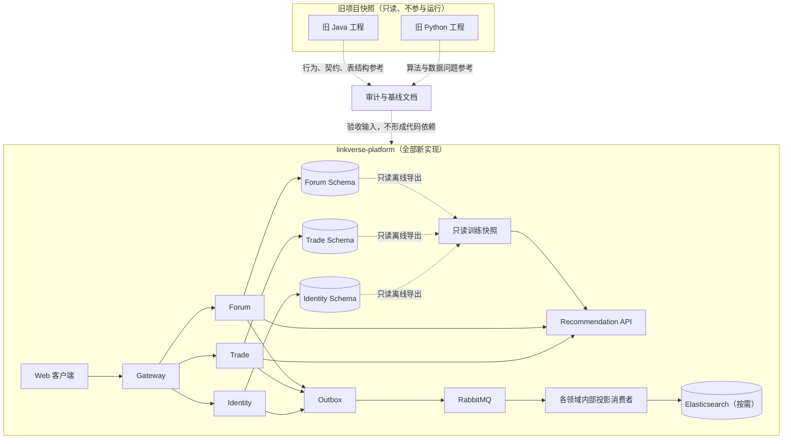

# LinkVerse 独立重建与替换规划

> [!IMPORTANT]
> 本文描述首个稳定版本的长期五部署单元蓝图（Gateway、Identity、Trade、Forum、Python Recommendation）。当前阶段 1～2 执行 [`04-MVP开发步骤与注意事项.md`](04-MVP开发步骤与注意事项.md) 的求职 MVP 覆盖层：部署 Gateway、Identity、Trade、Payment 四个 Java 单元，Forum 与 Recommendation 延期，Payment 依 [`ADR-0001`](adr/0001-MVP独立Payment服务边界.md) 暂时独立。MVP 与本文冲突时以上述两份决策为准；恢复长期单元前需重新评审 Payment 去留和数据迁移。

## 1. 重构决策与边界

LinkVerse（知链空间）采用**独立新建、并行验证、受控切换**的方式完成重构，不在原 Java 或 Python 工程内修改、拆分或逐步替换代码。

仓库中的两个旧项目只作为只读参考快照：

- `KnowledgeLink-backend/`：用于核对旧接口、表结构、业务行为和历史注释。
- `KnowledgeLink-RecommenderSystem/`：用于分析原召回、排序、数据处理与模型训练思路。

“旧项目快照”专指仓库中的本地目录；若另有仍承载真实流量的现网遗留系统，它在切换前独立运行，但不得成为新服务的运行时依赖。

全部新代码、配置、迁移工具、测试和部署文件统一进入 `linkverse-platform/`。新工程不得依赖旧工程的 Maven 模块、Python 包、配置文件、数据库实体或运行服务，也不得直接复制整个旧模块后继续修改。

新系统仍保留微服务架构，聚焦“图书交易、知识论坛、双域推荐”。实时聊天不再实现；推荐系统保留“召回 → 粗排 → 精排 → 重排”的技术路线，但重新设计训练数据、模型目标和服务契约。

本文后续阶段划分是长期建设顺序，不作为当前仓库完成度的证据。求职 MVP 阶段 1～2 的实际验收以 [`05-MVP阶段1与阶段2验收记录.md`](05-MVP阶段1与阶段2验收记录.md) 为准。项目不引入 Swagger/Knife4j，也不输出测试 API 文档。

## 2. 仓库与新代码目录

目标目录结构如下：

```text
LinkVerse/
├─ linkverse-platform/                 # 唯一的新系统代码根目录
│  ├─ backend/
│  │  ├─ pom.xml                       # 新 Maven Reactor
│  │  ├─ platform-bom/
│  │  ├─ starters/                     # Web、安全、错误、日志与可观测能力
│  │  └─ services/
│  │     ├─ linkverse-gateway/
│  │     ├─ linkverse-identity/
│  │     ├─ linkverse-trade/
│  │     └─ linkverse-forum/
│  ├─ recommendation/
│  │  ├─ pyproject.toml
│  │  ├─ src/linkverse_recommendation/
│  │  └─ tests/
│  ├─ contracts/                       # 机器可读的事件与跨服务契约
│  ├─ infrastructure/                  # Compose、Nacos、观测与本地环境
│  ├─ tools/                           # 一次性数据迁移、校验与对账工具
│  ├─ frontend/                        # 阶段 9 才生成
│  └─ tests/e2e/
├─ docs/                               # 中文设计文档
├─ .agents/                            # 英文治理技能
├─ KnowledgeLink-backend/              # 忽略且只读的旧 Java 快照
└─ KnowledgeLink-RecommenderSystem/    # 忽略且只读的旧 Python 快照
```

目录边界必须满足：

1. 新运行时代码只能位于 `linkverse-platform/`，根目录仅保留文档、治理文件和旧快照。
2. 旧目录继续由 `.gitignore` 排除，不对其格式化、升级依赖或修复业务问题。
3. 新 Maven Reactor、Python 包、前端工程和 Compose 均从新目录独立启动。
4. 新旧服务使用不同端口、Nacos namespace、数据库 Schema、Redis key 前缀、RabbitMQ vhost/exchange 和 ES 索引前缀。
5. 允许参考旧业务规则和注释；如复用少量局部逻辑，必须先在新目录形成独立实现，再逐文件审查和补测试，禁止在旧模块内修改或整模块复制。
6. 新服务不得调用仓库快照或现网遗留系统。只读对照由外部验证工具完成；历史数据只能通过受控导出和一次性迁移进入新模型。

## 3. 现状审计摘要

### 3.1 旧 Java 快照

- 旧工程由 `common`、`gateway`、`user`、`trade`、`forum`、`chat` 六个模块组成。
- 服务发现、固定路由和 `bootstrap.yml` 并存，认证可被伪造请求头绕过。
- 交易缺少可靠幂等、库存事务、正式支付校验和严格状态机，金额仍使用浮点数。
- RabbitMQ 可能先于事务提交；MySQL、Redis、ES 存在同步多写。
- 论坛缓存和计数存在并发丢失及旧值覆盖新值的风险。
- 自动化测试不足，且部分测试会访问真实索引或外部服务。

这些问题只作为新设计的反例和验收输入，不在旧目录内修复。

### 3.2 旧推荐快照

- 原系统包含六路召回、三塔粗排、多任务 DCN 精排和 MMR 重排。
- 现有交互数据缺少曝光负样本，部分评分与行为冲突，并存在全历史统计回填造成的特征泄漏。
- CSV、数据库、Java 和 FastAPI 的用户及物品 ID 不一致。
- 损失函数、任务头注册、负采样、OOV、模型映射和在线微调存在阻断级问题。
- Java 端尚未真实接入 Python 推荐结果。

新推荐工程仅继承分阶段推荐的基础思想，不直接加载旧模型或把旧权重作为新系统基线。新 Python 服务对业务数据源始终只读。

## 4. 新系统目标架构

首个稳定版本包含五个可独立部署单元：

1. `linkverse-gateway`：统一入口、服务路由、粗粒度鉴权、限流与追踪。
2. `linkverse-identity`：账号、认证、用户资料、关注关系和令牌生命周期。
3. `linkverse-trade`：商品、购物车、库存、订单、支付和秒杀。
4. `linkverse-forum`：帖子、评论、互动和内容检索。
5. `linkverse-recommendation`：Python 离线训练与在线推断，只读数据并返回推荐结果。

`logger`、`error` 和追踪能力实现为新工程内部的 Java Starter 与 Python 基础包，不建设同步调用的独立网络服务。



本地环境可以共享一个 MySQL 实例，但各服务必须独占 Schema。Redis、RabbitMQ 和 ES 同样按领域划分命名空间；任何服务不得跨边界直接写其他服务的数据。

图中的投影消费者随数据所有服务部署，只写本领域 Redis/ES 投影；训练快照由只读离线导出任务生成，不新增跨 Schema 写入的中央业务服务。

## 5. 最小且可控的建设方法

新建工程不等于一次性重写。每一步仍只交付一个可验证的不变量或一条纵向链路：

- **先隔离，再创建：** 先建立 `linkverse-platform/` 和旧快照边界，再引入任何框架或业务代码。
- **契约先行：** 先定义领域术语、状态机、事件和数据所有权，再实现 Controller、Service 或模型。
- **纵向小步：** 每次完成“契约 → 实现 → 测试 → 观测 → 回滚”，不同时铺开多个服务。
- **独立数据面：** 新服务只写新 Schema；禁止新旧业务服务共用表，也禁止为迁移而长期双写新旧数据库。
- **只读对照：** 可使用脱敏旧数据和影子读比较结果，但对照过程不得改变旧数据库。
- **禁止同步多写：** 新业务事务只写所属 MySQL Schema 和同事务 Outbox；Redis、ES 与训练数据均为提交后投影。
- **单 PR 单目标：** 目录骨架、依赖升级、Schema、业务行为和数据迁移分别提交。
- **阶段性稳定点：** 每阶段完成后创建可复现基线；后续失败回到最近稳定的新系统版本，而不是修改旧代码救火。

阶段 1 以后统一完成条件为：新目录可独立构建、自动化测试通过、关键指标可观测、数据变更可重复、失败路径已验证、无新增明文密钥、旧快照校验结果未发生变化。
阶段 0 只执行目录隔离、安全处置和基线门禁，不适用构建、业务测试或可观测门禁。

## 6. 分阶段实施顺序

### 阶段 0：新旧隔离与建设基线

**工作内容**

- 创建 `linkverse-platform/` 空骨架和 `README.md` 边界说明，明确它是唯一的新代码根目录。
- 生成 `docs/04-阶段0基线与隔离清单.md`，记录旧快照 SHA-256、路由、表、消息、关键接口、核心行为和环境命名分配。
- 在外部密钥系统撤销或轮换旧配置引用的真实凭据，不修改快照；旧文件中的字面值一律视为已失效且禁止使用。
- 仓库快照不得部署。若存在现网遗留系统，其运行和停写由独立切换计划管理。
- 规划新旧环境的端口、Nacos namespace、Schema、Redis 前缀、RabbitMQ vhost 和 ES 索引前缀。
- 将旧系统可复现行为转成基线用例说明；测试替身不得连接真实支付、真实索引或外部 AI 服务。

**验收**

- `linkverse-platform/` 只有目录骨架和边界说明，不含业务实现。
- 依赖与配置扫描中，旧目录名、旧包名、旧服务 URL、软链接和运行时调用的命中数均为 `0`。
- `git check-ignore` 能命中两个旧目录，复验 SHA-256 与基线清单完全一致。
- 基线清单覆盖登录、普通下单、支付回调、帖子、评论、互动和旧推荐入口，并为每项记录来源、输入和预期结果。
- 所有发现的真实凭据和危险入口均有 `已轮换`、`已撤销` 或 `已隔离` 状态；测试替身没有真实外部连接。

**回滚**

- 可以回退新目录骨架和测试配置；密钥撤销、访问隔离等安全处置不得回滚。

> 阶段 0 不要求新系统具备业务能力。新工程的“全新环境可重复构建”从阶段 1 开始验收。

### 阶段 1：基础框架与依赖

**工作内容**

- 在 `linkverse-platform/backend/` 创建全新 Maven Reactor、BOM、Starters 和四个 Java 服务骨架。
- 在 `linkverse-platform/recommendation/` 创建独立 Python 3.12 包、锁文件和测试结构。
- 引入 Nacos 服务发现与配置，统一使用 `spring.config.import`，不产生 `bootstrap.yml`。
- 完成新 Gateway 的基础路由；在 `linkverse-platform/infrastructure/` 建立本地 Compose 和健康检查，核心中间件默认启用，`observability`、`search` 使用可选 profile。
- 所有服务使用新端口和新 namespace，不把旧服务配置成回退依赖。

**验收**

- `mvn -f linkverse-platform/backend/pom.xml clean verify` 可在全新环境通过。
- Python 包可安装，最小 pytest 可执行；依赖由锁文件管理。
- 新 Java 服务注册到独立 Nacos namespace，并由新网关按服务名路由。
- MySQL、Redis、RabbitMQ、Nacos 与观测环境具有健康检查；`search` 未启用时系统仍可启动。

**回滚**

- 停止新 Compose 与新服务，回退新工程版本；旧快照和旧数据不受影响。

### 阶段 2：基础能力

**工作内容**

- 全新实现 `identity`，采用 OAuth2/OIDC、非对称短期 JWT、刷新令牌轮换和安全密码哈希。
- 网关与各资源服务分别验证签名、`iss`、`aud`、`exp`，不信任可伪造的身份请求头。
- 在 `starters/` 建立统一中文错误、参数校验、请求 ID、幂等键、结构化日志和 OpenTelemetry。
- 建立新服务的安全、错误、日志和追踪测试，不复用旧 `common` 模块。

**验收**

- 直连资源服务仍无法伪造身份；过期、撤销及错误受众令牌均被拒绝。
- 一次跨服务请求可通过 `trace_id` 串联日志、指标和链路。
- 业务错误不泄露堆栈、SQL、密钥或内部地址。

**回滚**

- 仅回退新服务镜像和配置；认证密钥支持双公钥过渡。

### 阶段 3：交易链路

交易服务按“普通交易正确性 → 正式支付 → 秒杀”建设，全部基于新领域模型和新 Trade Schema。

#### 3A 商品、购物车、库存与订单

- 从业务不变量重新设计商品、库存、购物车、订单和订单项，不复制旧实体结构。
- 金额使用 `DECIMAL`/`BigDecimal`；订单保存商品、价格、卖家和收货信息快照。
- 使用请求幂等键、数据库条件扣库存、唯一约束和显式订单状态机。
- 同一 MySQL 事务写业务数据与 Outbox；禁止在线程池中修改库存。
- 如需旧商品或用户数据，使用 `tools/` 中的独立迁移任务从只读快照单向导入新 Schema。

**验收：** 重复请求只产生一个订单；并发扣减不超卖；事务失败不留下订单、库存或消息残留；新服务不查询旧业务表。

#### 3B 支付

- 每次支付创建唯一 `payment_attempt`，保存金额、商户、币种和提供方快照。
- 回调必须验签并核对商户、订单、币种和金额；浏览器跳转不改变支付状态。
- 回调、主动查询、关单、退款和对账使用条件状态迁移与幂等记录。

**验收：** 重放、乱序、延迟和伪造回调不能造成重复入账或非法状态；支付与超时竞争可审计、对账和补偿。

#### 3C 秒杀

- 仅在普通交易与正式支付稳定、且压测证明需求后启用。
- Redis Function/Lua 原子完成活动校验、单用户限制和库存镜像准入；RabbitMQ 异步削峰。
- MySQL 条件扣库存仍是最终防超卖边界；预约失败、超时和毒消息均有幂等补偿。

**验收：** 并发压测下无超卖、无一人多单、无无限积压；Redis 或 RabbitMQ 故障后能够对账恢复。

### 阶段 4：论坛链路

**工作内容**

- 在新 Forum Schema 中实现帖子、评论、点赞和收藏，不迁移实时聊天业务。
- 用户关注关系只由 Identity 的 `user_follow` 拥有；Forum 仅消费关注变更事件并维护可重建的只读投影。
- 权限和状态约束先于缓存；点赞、收藏使用数据库唯一键保证幂等。
- 计数由已提交事件增量更新，并能从事实表重建。
- Redis 只保存热点、缓存和短期计数；初期使用 MySQL 检索，达到启用门槛后再构建 ES 投影。
- 旧论坛数据如需保留，使用只读导出和可重复迁移导入新 Schema。

**验收**

- 非作者不能修改或删除内容；重复互动不改变最终事实和计数。
- Redis 清空后可恢复；ES 停止后不影响内容写入，索引可全量重建。
- 新 Forum 不调用旧 Forum、Chat 或旧数据库表。

### 阶段 5：生成新行为数据与离线转换旧快照

**工作内容**

- 由新 Trade 和 Forum 统一产生版本化行为事件，至少包含 `event_id`、用户、领域、对象、动作、时间、请求、会话、位置、来源和 Schema 版本。
- 交易记录曝光、详情、加购、下单、支付成功和退款；论坛记录曝光、打开、停留、点赞、收藏、评论、分享、隐藏和举报。
- Java 服务写业务事实与 Outbox，并生成匿名化只读训练快照；Python 只读取快照。
- 旧推荐数据只作为质量分析输入。若使用历史样本，必须先修复 ID、重复、漏斗、时间和标签问题，并标记来源。
- 合成数据单独标识，不进入真实线上评估集。

**验收**

- 每个正反馈能追溯到曝光或合法上游行为；支付成功才作为购买标签。
- 特征按事件发生时刻构造，不使用未来统计。
- 新旧数据来源可区分，训练集能够按版本完整复现。

### 阶段 6：模型训练

**工作内容**

- 在新 Python 包中重新实现数据校验、特征处理、训练、评估和打包，不直接加载旧模型权重。
- 保留多路召回思想，但保存各通道分数、来源和配额；交易与论坛使用独立对象塔及 ANN 索引。
- 粗排使用轻量多塔；精排采用共享骨干与领域专属多任务头；重排只处理最终候选。
- 使用时间切分，记录 Recall@K、NDCG@K、AUC、LogLoss、校准和领域业务指标。
- 模型包包含权重、词表、OOV、Scaler、特征 Schema 哈希、数据版本、指标、Faiss 索引和 `model_version`。

**验收**

- 固定数据和随机种子能够重现实验；训练不依赖旧 Python 运行环境。
- 模型包可在无数据库写权限时完整加载。
- 新模型通过离线门禁后才能进入影子流量，不直接覆盖当前稳定版本。

### 阶段 7：整合推荐微服务

**工作内容**

- 新 Trade/Forum 发送用户、场景、业务过滤条件和 `traceparent`；Recommendation 返回对象 ID、分数、原因、通道和模型版本。
- Python 在线请求只使用内存、Faiss 和只读快照，不执行全表查询、训练或写库。
- Java 负责可见性、可售性和权限过滤；调用设置超时、舱壁、熔断和热门内容降级。
- 模型按版本原子热切换，支持影子、灰度和一键回滚。

**验收**

- Recommendation 不可用时，交易和论坛核心功能仍可使用。
- Python 账号只有 `SELECT` 权限；任何 MySQL、Redis 或 ES 写入设计必须先取得用户明确批准。
- 新服务之间只使用版本化契约，不调用旧推荐接口。

### 阶段 8：生成前端界面设计稿

- 基于新系统的信息架构和版本化契约设计交易、论坛与推荐界面。
- 覆盖加载、空数据、失败、支付处理中、库存不足和推荐降级等状态。
- 设计稿评审通过后冻结组件契约；本阶段不生成前端代码。

### 阶段 9：生成前端文件

- 仅在 `linkverse-platform/frontend/` 中实现已批准的页面、组件、路由、状态和错误处理。
- 前端只调用新 Gateway，不引用旧接口或旧前端资源。
- 支付结果通过服务端状态查询确认，不信任回跳参数。

### 阶段 10：前后端整合测试与切换

- 使用外部 API 测试插件、单元测试、契约测试、Testcontainers、端到端测试和并发压测完成验收。
- 覆盖认证绕过、重复下单、库存竞争、支付乱序、消息重放、中间件故障和模型回滚。
- 外部验证工具使用脱敏快照或现网遗留系统的公开只读接口执行结果对照；新服务不得调用旧服务，差异必须有业务解释或缺陷记录。
- 形成上线检查表、数据迁移核对表、流量切换方案和故障处置步骤。

**验收**

- 新系统在不启动任何旧服务的情况下完成全链路运行。
- 构建、部署、监控、迁移和回滚命令均只引用 `linkverse-platform/`。
- 旧快照仍保持只读并被 Git 忽略；是否归档或删除必须另行获得用户批准。

## 7. 数据迁移、流量切换与回滚

### 7.1 数据迁移

- 现网遗留数据库（如存在）在迁移侧只读；迁移任务读取脱敏快照，转换后写入新服务拥有的 Schema。
- 迁移工具使用旧源只读账号和新目标分域写账号，单个任务只能写一个目标 Schema。
- 按 Identity → Trade → Forum → 行为事件的顺序迁移；使用版本化 ID 映射处理外键、删除标记和历史孤儿数据。
- 迁移脚本位于 `linkverse-platform/tools/`，具有版本、输入校验值、断点续跑、幂等重试和对账报告。
- 各领域负责人分别验收主键、状态、金额、库存和计数；容差必须在执行前书面确定。
- Python 推荐模块不承担业务数据写入；业务数据迁移由受控迁移工具完成。
- 不建立长期的新旧双写。正式切换前采用“旧系统短暂停写 → 最终增量迁移 → 数量及金额对账 → 切换流量”。

### 7.2 流量切换

- 无状态查询先由外部验证工具进行只读影子比较，再按接口或用户比例灰度。
- 交易写链路必须整体切换，不能把库存、订单和支付拆到新旧系统两侧。
- 论坛可按只读、互动写入、内容写入的顺序切换，但每个对象的事实源在任一时刻只能有一个。

### 7.3 回滚

- 切换前，直接停用新服务即可，旧系统和旧数据不受影响。
- 切换后但尚无新业务写入时，可以恢复旧路由。
- 一旦新系统产生订单、支付或论坛写入，禁止直接把流量切回旧系统。应先停止相关写入并完成数据对账，再选择修复前进或执行经单独审批的反向迁移。
- 支付等已产生外部副作用的操作以补偿和对账恢复，不通过数据库快照覆盖。

## 8. 阶段门禁与交付纪律

| 门禁 | 最低要求 |
|---|---|
| 目录隔离 | 新代码只在 `linkverse-platform/`；旧快照无修改且无运行时依赖 |
| 构建 | 新工程可独立构建，依赖由 BOM 或锁文件管理 |
| 数据 | 新旧 Schema 隔离；迁移可重复、可校验且有明确事实源 |
| 测试 | 单元、契约、集成测试覆盖本阶段新增不变量 |
| 安全 | 无明文密钥，无绕过认证入口，权限最小化 |
| 一致性 | 明确幂等键、事务范围、消息语义和补偿路径 |
| 可观测 | 日志包含服务名、请求 ID、trace ID 和业务键 |
| 性能 | 使用基线和压测数据决定 Redis、ES 与秒杀能力的启用时机 |
| 回滚 | 区分切换前回退、无写入回退和有状态写入后的恢复方案 |

任一阶段未通过门禁，不得并行进入依赖它的下一业务阶段。

## 9. 已确定与待确认事项

已确定：

- 项目名称为 LinkVerse / 知链空间。
- `linkverse-platform/` 是唯一新代码根目录。
- 两个旧项目仅作只读参考，不进行原地重构，也不成为新系统依赖。
- 保留微服务架构，移除实时聊天，保留用户关注关系。
- 不使用 Swagger/Knife4j。
- Python 对业务 MySQL、Redis 和 ES 只读；训练可写版本化模型产物，写模型注册表或在线特征仍须单独批准。
- MySQL 是唯一业务事实源；Redis、ES 和推荐索引均为可重建派生数据。

以下决策必须在对应门禁前冻结：

| 最迟时间 | 必须确认的决策 |
|---|---|
| 阶段 1 结束前 | 历史数据迁移范围、保留规则、统一 ID 映射与领域验收人 |
| 阶段 3B 开始前 | 正式支付提供方、商户模式、退款与分账范围 |
| 阶段 3C 开始前 | 秒杀目标并发、活动规模和允许排队时延 |
| ES 启用前 | 检索需求、数据规模、中文相关性和延迟目标 |
| 阶段 6 开始前 | 离线指标阈值、模型产物存储；任何模型注册表或在线特征写入须另行批准 |
| 阶段 10 开始前 | 停写窗口、RTO/RPO、旧系统保留周期和有状态回滚方案 |
