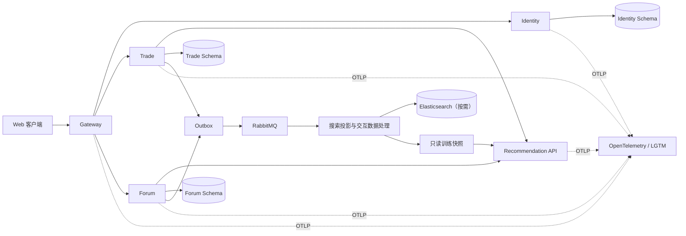

# LinkVerse 重构规划

## 1. 目标与边界

LinkVerse（知链空间）将保留微服务架构，并围绕“图书交易、知识论坛、双域推荐”重新划分边界。重构优先解决安全、数据一致性、可观测性和可测试性，再逐步迁移业务。实时聊天模块整体移除；推荐系统保留“召回 → 粗排 → 精排 → 重排”的技术思路，但重新定义训练数据、模型目标和服务集成方式。

本轮仅建立规划、规范与仓库治理文件，不生成业务代码、前端文件、Docker Compose 或数据库迁移。API 测试由外部插件完成，不引入 Swagger、Knife4j，也不输出测试 API 文档。

## 2. 现状审计摘要

### 2.1 Java 模块

- 当前共有约 180 个 Java 文件、9,122 行代码，拆为 `common`、`gateway`、`user`、`trade`、`forum`、`chat` 六个模块。
- 网关使用固定地址路由，部分服务关闭 Nacos，部分服务仍读取 `bootstrap.yml`，服务发现与配置来源不一致。
- 业务服务信任可伪造的用户请求头，未登录场景还可能回退到固定用户；密码、令牌过期和网关绕过均存在阻断级风险。
- 交易链路缺少幂等、可靠库存事务和正式支付校验；库存扣减存在脱离事务的线程操作，金额仍使用浮点数。
- RabbitMQ 消息可能先于数据库事务提交，且缺少 Outbox、发布确认和消费去重。
- 论坛计数采用 Redis 读改写及定时覆盖 MySQL，存在并发丢失和旧缓存覆盖新数据的风险。
- MySQL、Redis、ES 存在同步多写，没有可靠的提交后同步或可重放投影。
- 仅有三个后端测试，且包含编译失配、真实索引删除和外部服务依赖，不能作为重构安全网。

### 2.2 推荐模块

- 当前约 18 个 Python 文件、3,309 行代码，实现六路召回、三塔粗排、多任务 DCN 精排与 MMR 重排。
- 94,934 条交互覆盖 10,000 个用户和 6,262 个物品，但点击正例率为 100%，没有“曝光未点击”负样本。
- 55,249 条交互的 `rating` 与行为字段不一致；“最近三个月”统计实为全历史统计，并被回填到历史样本，形成标签泄漏。
- CSV 使用 `U00001`、`I0001` 字符串标识，而数据库、Java 和 FastAPI 使用 `BIGINT`，模型词表无法可靠对齐。
- 粗排和精排损失函数、精排任务头注册、负采样、OOV、模型映射和在线微调均存在阻断级正确性问题。
- Java 交易服务实际返回随机书籍，Python 推荐调用被注释；论坛推荐则独立在 Java 中随机化，两域尚未真正接入统一推荐系统。
- Python 当前数据库操作为只读；此边界应继续保持。

## 3. 目标架构

首个稳定版本只保留五个可部署单元：

1. `linkverse-gateway`：统一入口、路由、粗粒度鉴权、限流和追踪。
2. `linkverse-identity`：账号、认证、用户资料和令牌生命周期。
3. `linkverse-trade`：商品、购物车、库存、订单、支付和秒杀。
4. `linkverse-forum`：帖子、评论、互动、关注和内容检索。
5. `linkverse-recommendation`：Python 训练与在线推断，只读取数据并返回推荐结果。

`logger` 与 `error` 不建设为独立网络服务，而是形成可复用的 Java Starter 和 Python 基础包，避免为横切能力增加同步调用。

本地开发可让各服务使用同一个 MySQL 实例中的独立 Schema；逻辑上仍由服务独占数据所有权，禁止跨服务直接写表。

## 4. 最小且可控的重构方法

每一步只改变一个可验证的不变量或一个服务边界：

- **先建立基线，再替换实现：** 为现有关键行为补充特征测试，不能在没有安全网时直接重写。
- **分支替换：** 新旧实现通过配置开关并存；新实现通过影子流量、灰度或双读比较后再切换。
- **数据库扩展—迁移—收缩：** 先加新表或可空列，再回填和兼容读，最后移除旧结构。
- **禁止同步三写：** 业务事务只写 MySQL 和同事务 Outbox，Redis、ES 与推荐数据均由提交后事件更新。
- **单 PR 单目标：** 依赖升级、Schema 迁移、业务行为改变和大规模重命名不得混入同一个 PR。
- **每阶段可回滚：** 配置、路由、消费者和模型必须保留最近一个稳定版本及明确回退步骤。

每个阶段的统一完成条件为：构建通过、自动化测试通过、迁移可重复执行、关键指标可观测、回滚演练完成、无新增明文密钥。

## 5. 分阶段实施顺序

### 阶段 0：风险封锁与可重复基线

**工作内容**

- 轮换已进入源码或测试配置的密钥；关闭生产可访问的模拟支付与推荐 `/fine_tuning`。
- 建立 JDK 21、Python 3.12、Maven 和容器镜像的版本基线。
- 记录现有路由、数据库表、消息拓扑和关键业务行为；建立最小冒烟与特征测试。

**验收**

- 全新环境可重复构建；测试不访问真实支付、真实索引或外部 AI 服务。
- 已知安全问题有关闭、隔离或轮换记录。

**回滚**

- 本阶段不改变业务数据，仅回退构建和配置基线。

### 阶段 1：基础框架与依赖

**工作内容**

- 创建新的 Maven Reactor 和 Python 包结构，统一 BOM，禁止模块自行覆盖核心依赖。
- 引入 Nacos 服务发现与配置，使用 `spring.config.import`，移除 `bootstrap.yml` 旧路径。
- 建立 Gateway 路由、服务健康检查和 Docker Compose 的 `core`、`observability`、`search` profiles。
- 明确内部服务不可从公网直接访问，所有配置均支持环境变量覆盖。

**验收**

- Java 服务通过 Nacos 注册并由网关按服务名路由；配置缺失时快速失败。
- MySQL、Redis、RabbitMQ、Nacos 与可观测环境均有健康检查。

**回滚**

- 新网关按路由逐项切流；单条路由可恢复旧服务。

### 阶段 2：基础能力

**工作内容**

- 建设 `identity`，采用 OAuth2/OIDC、非对称短期 JWT、刷新令牌轮换和密码安全哈希。
- 网关与每个资源服务均校验 JWT 的签名、`iss`、`aud`、`exp`，不单独信任转发身份头。
- 建立统一中文错误模型、全局异常处理、校验错误、请求 ID 和幂等键规范。
- 接入结构化 JSON 日志、Micrometer、OpenTelemetry 和 W3C Trace Context。

**验收**

- 绕过网关直连服务仍无法伪造身份；过期和撤销令牌均被拒绝。
- 一次跨服务请求可用 `trace_id` 串联日志、指标和链路。
- 业务异常不泄露堆栈、SQL、密钥或内部地址。

**回滚**

- 认证密钥支持双公钥过渡；新旧错误结构在限定兼容窗内由网关适配。

### 阶段 3：交易链路

按“普通交易正确性 → 正式支付 → 秒杀”的顺序拆分三个里程碑。

#### 3A 商品、购物车、库存与订单

- 金额使用 `DECIMAL`/`BigDecimal`；订单保存商品、价格、卖家和收货信息快照。
- 订单创建使用请求幂等键、数据库条件扣库存和显式状态机。
- MySQL 事务同时写业务表和 Outbox，不在线程池中修改库存。

**验收：** 重复请求只生成一个订单；并发扣减不超卖；事务失败不产生订单、库存或消息残留。

#### 3B 支付

- 每次支付生成唯一 `payment_attempt`；回调必须验签并核对商户、订单、币种和金额。
- 支付成功只由签名回调、主动查询或对账确认；前端跳转结果不改变订单状态。
- 回调、关单、退款和补偿都使用条件状态迁移与幂等记录。

**验收：** 重放、乱序、延迟和伪造回调不能造成重复入账或非法状态；收款与超时冲突可对账并补偿。

#### 3C 秒杀

- 仅在普通订单链路稳定并经压测确认需求后引入。
- Redis Function/Lua 原子完成活动校验、单用户限制和库存镜像准入；RabbitMQ 异步削峰。
- MySQL 条件扣库存仍是最终防超卖边界；失败预约必须过期或补偿。

**验收：** 并发压测下无超卖、无一人多单、无无限积压；Redis 或 MQ 故障后能够对账恢复。

### 阶段 4：论坛链路

**工作内容**

- 先迁移帖子、评论、点赞、收藏和关注的 CRUD、权限及状态约束。
- 点赞和收藏使用唯一键保证幂等；计数由事件增量更新并可从事实表重建。
- Redis 仅保存热点、缓存和短期计数；缓存失效不得覆盖 MySQL 新值。
- 初期使用 MySQL 索引检索；达到检索复杂度和性能触发条件后，再以 Outbox 事件构建 ES 投影。

**验收**

- 非作者不能修改或删除内容；重复互动不改变最终计数。
- Redis 清空后可从 MySQL 恢复；ES 停止后不影响内容写入，并可全量重建索引。

### 阶段 5：生成或清理用户交互数据

**工作内容**

- 定义统一事件：`event_id`、`user_id`、`domain`、`object_type`、`object_id`、`event_type`、`event_time`、`request_id`、`session_id`、`position`、`source`、`dwell_ms`、`schema_version`。
- 交易域记录曝光、详情、加购、下单、支付成功、退款；论坛域记录曝光、打开、停留、点赞、收藏、评论、分享、隐藏和举报。
- Java 服务负责写业务事实与 Outbox，并生成训练快照；Python 只读。
- 清理重复事件、非法漏斗、孤儿标识和时间异常；合成数据必须单独标记，不能与线上评估集混用。

**验收**

- 每个正反馈能追溯到曝光或合法上游行为；支付成功才作为购买标签。
- 训练样本按事件发生时刻构造特征，不使用未来统计。

### 阶段 6：模型训练

**工作内容**

- 先修复损失函数、任务头注册、负采样、OOV、ID 映射和特征泄漏，再训练新模型。
- 保留六路召回思想，但保存每路分数、来源和配额；交易与论坛使用独立对象塔及 ANN 索引。
- 粗排使用修复后的轻量三塔；精排采用共享骨干与域专属多任务头；重排只处理最终候选，不构建全目录相似矩阵。
- 使用时间切分的训练、验证、测试集，记录 Recall@K、NDCG@K、AUC、LogLoss、校准和业务指标。
- 模型包原子包含权重、词表、OOV、Scaler、特征 Schema 哈希、数据版本、指标、Faiss 索引和 `model_version`。

**验收**

- 固定数据和随机种子可重现实验；模型包在无数据库写权限时可加载。
- 新模型先通过离线阈值，再进入影子流量，不允许直接覆盖线上模型。

### 阶段 7：整合推荐微服务

**工作内容**

- Java 发送用户、场景、候选过滤信息和 `traceparent`；Python 返回对象 ID、分数、原因、通道和模型版本。
- Python 在线请求只使用内存、Faiss 和只读快照，不在请求中全表查询或训练。
- 调用设置超时、舱壁、熔断和降级；降级结果为可售/可见的热门、新品或关注内容。
- 模型按版本原子热切换，支持影子、灰度和一键回滚。

**验收**

- 推荐服务不可用时交易和论坛核心功能仍可用。
- Python 账号只有 `SELECT` 权限；任何新增数据库、Redis 或 ES 写入必须先获得用户确认。

### 阶段 8：生成前端界面设计稿

- 先定义信息架构、设计令牌、响应式断点和交易/论坛/推荐关键状态。
- 覆盖加载、空数据、失败、支付处理中、库存不足和推荐降级等状态。
- 设计稿评审通过后冻结组件契约，不在此阶段生成前端代码。

### 阶段 9：生成前端文件

- 基于已批准设计稿实现页面、组件、路由、状态管理和错误处理。
- 不直接依赖后端内部模型，所有调用通过版本化 API 客户端。
- 对支付结果采用轮询或服务端状态查询，不信任前端回跳参数。

### 阶段 10：前后端整合测试

- 通过外部 API 测试插件、单元测试、契约测试、Testcontainers、端到端测试和并发压测完成验收。
- 覆盖认证绕过、重复下单、库存竞争、支付乱序、消息重放、Redis/ES/MQ 故障和模型回滚。
- 形成发布检查表、数据迁移核对表和故障回退步骤。

## 6. 阶段门禁与交付纪律

| 门禁 | 最低要求 |
|---|---|
| 构建 | 全新环境可构建，依赖由 BOM 或锁文件管理 |
| 数据 | 迁移可重复、可回滚，约束和索引有查询依据 |
| 测试 | 单元、契约、集成测试覆盖本阶段新增不变量 |
| 安全 | 无明文密钥，无绕过认证入口，权限最小化 |
| 一致性 | 明确事实源、幂等键、消息语义和补偿路径 |
| 可观测 | 日志包含服务名、请求 ID、trace ID 和业务键 |
| 性能 | 以基线和压测对比证明，不凭感觉引入缓存或 ES |
| 回滚 | 路由、Schema、消费者和模型均有已演练的回退方式 |

## 7. 已确定与待确认事项

已确定：

- 项目名为 LinkVerse / 知链空间。
- 移除实时聊天；保留用户关注关系。
- 不使用 Swagger/Knife4j。
- Python 对数据库只读，默认也不写 Redis 和 ES。
- MySQL 是唯一业务事实源；Redis、ES 和推荐索引均可重建。

后续进入实现前需要确认：

- 正式支付提供方、商户模式、退款与分账范围。
- 秒杀的目标并发、活动规模和允许的排队时延。
- ES 的实际检索需求、数据规模和延迟目标。
- Python 若需写入模型注册表、在线特征、缓存或索引，必须先提交单独设计并获得明确同意。
