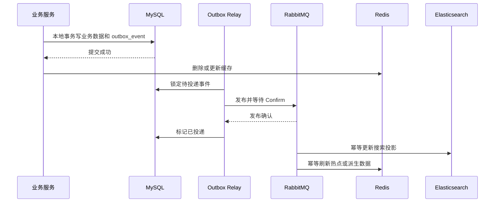

# LinkVerse 技术选型

## 1. 选型原则

1. 先保证交易正确性、安全和可观测，再追求吞吐量。
2. 一个问题只保留一个主中间件，不为“微服务感”堆叠组件。
3. MySQL 是业务事实源；缓存、搜索索引、消息和模型均允许重建。
4. 依赖使用 BOM 或锁文件管理，不在子模块随意覆盖核心版本。
5. 所有中间件通过 Docker Compose 提供本地与 CI 环境；Compose 不等同于生产高可用方案。
6. 版本升级与业务重构分开进行，避免同时引入多个不可控变量。

## 2. 建议技术基线

| 层级 | 选择 | 说明 |
|---|---|---|
| Java | Java 21 | 继续使用 LTS 版本 |
| 构建 | Maven 3.9.x | 使用 Wrapper 固定团队版本 |
| 应用框架 | Spring Boot 3.5.15 | 与选定 Spring Cloud 版本直接匹配 |
| 微服务套件 | Spring Cloud 2025.0.3 | 官方标注支持 Boot 3.5.15 |
| Alibaba 套件 | Spring Cloud Alibaba 2025.0.0.0 | 对应 Boot 3.5.x、Cloud 2025.0.x |
| 注册与配置 | Nacos Server 3.2.3 | 当前 GA；客户端版本由 Alibaba BOM 决定，接入前做兼容冒烟 |
| 数据库 | MySQL 8.4 LTS | 业务事实源；镜像固定到经验证的 8.4 补丁 |
| 缓存 | Redis 8.2.x | 缓存、限流、幂等窗口、热点与秒杀准入 |
| 消息 | RabbitMQ 4.3.x | Outbox 投递、异步解耦、延时关单、重试与停车队列 |
| 搜索 | Elasticsearch 8.18.1 | 延后启用；与 Spring Data 2025.0 版本线匹配 |
| Python | Python 3.12 | 与训练及推断依赖形成独立锁文件 |
| 推荐服务 | FastAPI、PyTorch、Faiss | 在线推断、深度模型和向量召回 |
| 可观测 | Micrometer、OpenTelemetry、Grafana LGTM | Java/Python 统一 OTLP 与 W3C Trace Context |

暂不迁移到 Spring Boot 4。虽然当前已有 Boot 4/Cloud 2025.1 稳定线，但它会同时引入 Spring Framework 7、Jakarta 与 Jackson 3 等额外变化，不符合本次“小步可控”的目标。

## 3. 服务与依赖边界

### 3.1 Java 服务

- `linkverse-gateway`：Spring Cloud Gateway WebFlux、OAuth2 Resource Server、Redis RateLimiter、Resilience4j、Actuator。
- `linkverse-identity`：Spring Security、Spring Authorization Server、MySQL、Redis。
- `linkverse-trade`：Spring MVC、MyBatis-Plus、MySQL、Redis、RabbitMQ；ES 仅作为可选商品搜索投影。
- `linkverse-forum`：Spring MVC、MyBatis-Plus、MySQL、Redis、RabbitMQ；ES 仅作为可选内容搜索投影。

共享代码只保留三个窄模块：

- `platform-core`：纯 Java 值对象、错误码和无框架工具。
- `platform-web`：统一响应、校验、异常转换和鉴权适配。
- `platform-observability`：日志字段、指标、追踪和脱敏规则。

共享模块不得依赖具体业务实体、Mapper 或业务 Service，避免重新形成“大 common”。

### 3.2 Python 服务

- `training`：读取只读快照，执行数据校验、特征构造、训练、评估和模型打包。
- `serving`：加载已发布模型包、Faiss 索引及必要内存特征，提供在线推荐。
- `pipeline`：召回、粗排、精排和重排的纯算法编排。
- `adapters`：只读数据源、模型存储和 HTTP 边界。

训练与在线推断分进程、分镜像；在线服务不得在启动或请求期间重新训练、全表扫描或下载全部远程图片。

## 4. 中间件取舍

| 组件 | 决策 | 引入时机 | 禁止用途 |
|---|---|---|---|
| Nacos | 保留 | 基础框架阶段 | 存储密钥、承担业务数据 |
| MySQL | 保留 | 从第一阶段开始 | 跨服务直接写表 |
| Redis | 保留 | 认证、限流先引入；热点和秒杀按阶段启用 | 最终库存、订单、支付事实源 |
| RabbitMQ | 保留 | 交易 Outbox 与行为事件阶段 | 假设 exactly-once、在事务提交前直接发布 |
| Elasticsearch | 延后 | 全文检索或相关性需求经压测成立后 | 主数据写入、支付/库存查询 |
| OpenTelemetry LGTM | 保留 | 基础能力阶段 | 生产环境单容器高可用方案 |
| Kafka | 不引入 | 当前 RabbitMQ 足以覆盖吞吐与解耦需求 | 与 RabbitMQ 重复建设 |
| Seata/XA | 不引入 | 使用本地事务、Outbox、幂等与补偿 | 跨支付提供方强行分布式事务 |
| Sentinel | 初期不引入 | 网关限流与 Resilience4j 足够 | 重复的限流和熔断配置 |
| Swagger/Knife4j | 不引入 | API 测试由用户指定插件完成 | 自动暴露测试 API 文档 |
| MLflow/Airflow/特征库 | 暂缓 | 实验或任务规模达到明确痛点后评估 | 在数据规范完成前增加平台复杂度 |

## 5. MySQL、Redis 与 ES 协同

### 5.1 数据职责

- **MySQL：** 保存账号、商品、库存、订单、支付、帖子、评论、互动事实、Outbox 和消费幂等记录。
- **Redis：** 保存短 TTL 缓存、限流令牌、刷新令牌状态、幂等窗口、热门榜单和秒杀库存镜像。
- **ES：** 保存商品与帖子搜索文档。文档只能由 MySQL 事件投影生成，删除 ES 索引后必须能全量重建。

### 5.2 写入路径

不允许在同一个请求中同步写 MySQL、Redis、ES 后才返回成功。Redis 或 ES 更新失败不能回滚已提交业务事务，应由事件重试、重放或全量重建恢复。

### 5.3 缓存策略

- 默认使用 Cache-Aside：先提交 MySQL，再删除缓存；对极热点数据可使用延迟双删，但必须通过压测证明需要。
- 缓存键包含业务域和 Schema 版本，例如 `lv:trade:listing:v1:{id}`。
- TTL 添加随机抖动；空值使用短 TTL 防穿透；热点重建使用短锁或单飞，不用长时间分布式锁包围业务事务。
- 支付、库存与订单状态读取可使用缓存加速展示，但业务决策必须回到 MySQL 或受控的原子准入逻辑。

### 5.4 ES 启用门槛

只有出现以下至少一项并有基准数据时才启用 ES：

- 需要中文分词、相关性、同义词、高亮或多字段组合检索；
- MySQL 合理索引后仍无法达到已约定的搜索延迟；
- 商品或帖子规模、查询并发已经使关系库搜索影响核心事务。

ES 上线前必须具备别名切换、全量重建、增量追平、版本字段和投影延迟指标。Spring Data 2025.0 对应 Elasticsearch 8.18.1，不沿用当前手工覆盖的 9.x 客户端。

## 6. 微服务基础设施

### 6.1 Nacos

- 服务名统一为 `linkverse-{domain}`，配置按 `namespace/group/data-id` 隔离环境。
- 使用 `spring.config.import=nacos:...`，不再使用 `bootstrap.yml`。
- 注册、配置健康状态接入 Actuator；关键配置缺失时快速失败。
- 数据库密码、支付私钥和 JWT 私钥不进入 Nacos 明文，使用环境变量或 Docker secrets。

### 6.2 网关

网关只承担路由、CORS、请求大小、粗粒度认证、限流、灰度标记、请求 ID 和追踪传播。业务编排、库存判断、订单状态迁移不得写在网关。

限流键按匿名 IP、用户、接口和活动组合；高风险接口还需业务服务二次限流。熔断只用于可降级的远程读取，不得把支付写请求自动重试为未知次数。

### 6.3 认证

- 使用 Spring Authorization Server 提供 OAuth2/OIDC，使用非对称密钥签发短期 JWT。
- 网关和每个资源服务都作为 Resource Server 校验签名、发行方、受众和有效期。
- 刷新令牌轮换并保存撤销状态；密码采用 Argon2id 或 BCrypt。
- 服务间调用使用独立客户端身份，不转发用户可控的 `X-User-*` 作为信任根。

### 6.4 错误、日志与追踪

- HTTP 错误使用 `application/problem+json`，包含稳定错误码、中文提示、`request_id` 和 `trace_id`。
- 结构化日志至少包含时间、级别、服务、环境、线程、请求 ID、trace/span ID、用户匿名标识和业务键。
- 密码、令牌、支付报文、身份证件、手机号和完整地址必须脱敏。
- Java 使用 Micrometer Observation/Tracing；Python 使用 OpenTelemetry SDK；统一向 OTLP Collector 发送。
- 本地使用 `grafana/otel-lgtm` 单容器；生产拆分 Collector 与存储。

## 7. 消息与一致性

采用“本地事务 + Outbox + 至少一次投递 + 幂等消费”：

1. 业务数据与 `outbox_event` 在同一 MySQL 事务提交。
2. Relay 使用 `FOR UPDATE SKIP LOCKED` 分批取事件。
3. 发布端开启 Publisher Confirm 和不可路由消息处理。
4. 消费者以 `event_id` 唯一约束去重，业务事务提交后才 ACK。
5. 重试必须有次数和退避上限；超限进入停车队列并支持人工重放。
6. 事件包含 `event_id`、`event_type`、`aggregate_id`、`occurred_at`、`schema_version`、`trace_id`。

不宣称 exactly-once。幂等键、条件更新和对账才是最终正确性保障。

## 8. 推荐技术调整

保留现有四阶段理念，但不保留错误实现：

- **召回：** 交易和论坛分别维护 ItemCF/LightGCN、双塔 ANN、内容语义、热门与新内容通道；保留通道分数和来源，不做无序集合并集。
- **粗排：** 使用修复后的轻量三塔或经基准验证的树模型；先执行可售、库存、作者屏蔽和内容可见性过滤。
- **精排：** 共享用户骨干，使用交易/论坛域专属多任务头；采用正确的 Logits 与损失函数。
- **重排：** 对有限候选进行 MMR、作者/卖家配额、新鲜度和探索约束，不构建全目录 N×N 矩阵。
- **训练：** 使用曝光构造负样本，按时间切分，所有统计特征必须满足 point-in-time 正确性。
- **发布：** 模型包包含权重、词表、特征 Schema、指标、索引和版本；通过影子、灰度、回滚完成上线。

Python 只读 MySQL 快照或只读副本。默认禁止 Python 写 MySQL、Redis 和 ES；任何例外必须形成独立设计并取得用户明确同意。

## 9. Docker Compose 规划

- 无 profile：MySQL、Redis、Nacos、RabbitMQ。
- `observability`：`grafana/otel-lgtm`。
- `search`：Elasticsearch。
- `recommendation`：推荐在线服务及只读模型卷。

所有服务配置健康检查、命名卷、内部网络、资源限制和固定镜像补丁。使用 `depends_on.condition: service_healthy` 控制本地启动顺序，但应用自身仍必须具备超时、重试和就绪检查。真实 `.env`、密钥及本地数据卷不得提交。

## 10. 官方依据

- [Spring Cloud 2025.0.3 与 Boot 3.5.15 兼容信息](https://docs.spring.io/spring-cloud-release/reference/2025.0/index.html)
- [Spring Cloud Alibaba 2025.x 兼容矩阵](https://sca.aliyun.com/en/docs/2025.x/overview/version-explain/)
- [Nacos `spring.config.import` 配置方式](https://sca.aliyun.com/en/docs/2025.x/user-guide/nacos/quick-start/)
- [Nacos 发布历史](https://nacos.io/en/download/release-history/)
- [Spring Cloud Gateway](https://docs.spring.io/spring-cloud-gateway/reference/4.3/index.html)
- [Spring Security JWT Resource Server](https://docs.spring.io/spring-security/reference/servlet/oauth2/resource-server/jwt.html)
- [Spring Boot 可观测性](https://docs.spring.io/spring-boot/reference/actuator/observability.html)
- [Grafana Docker OpenTelemetry LGTM](https://grafana.com/docs/opentelemetry/docker-lgtm/)
- [RabbitMQ 可靠性指南](https://www.rabbitmq.com/docs/reliability)
- [Redis 原子脚本](https://redis.io/docs/latest/develop/programmability/eval-intro/)
- [MySQL 8.4 锁定读](https://dev.mysql.com/doc/refman/8.4/en/innodb-locking-reads.html)
- [Spring Data Elasticsearch 版本矩阵](https://docs.spring.io/spring-data/elasticsearch/reference/elasticsearch/versions.html)
- [Docker Compose Profiles](https://docs.docker.com/compose/how-tos/profiles/)
