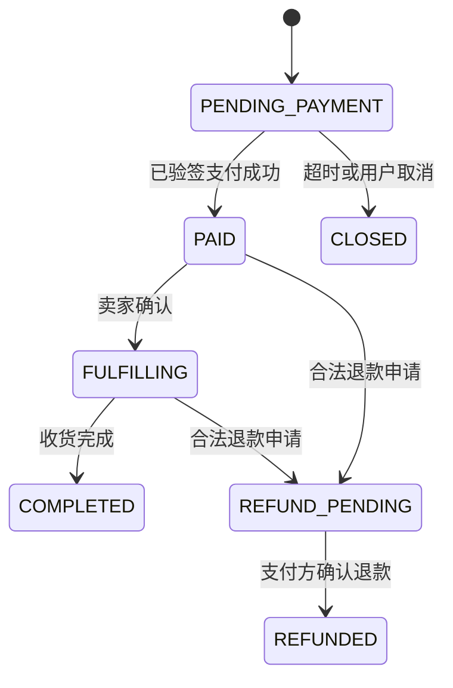

# LinkVerse 业务规范

## 1. 核心原则

- 交易、论坛、身份和推荐是独立业务边界；跨服务只能通过版本化 API 或事件协作。
- MySQL 保存最终业务事实，Redis、ES、统计表和模型均为派生数据。
- 金额、库存、订单、支付和权限校验必须在服务端完成，不能信任客户端结果。
- 所有写请求都要定义幂等语义、事务边界、失败补偿和可观测字段。
- Python 训练与推断默认只读数据，不写 MySQL、Redis 或 ES。
- API 测试由指定插件执行；项目不引入 Swagger/Knife4j，不生成测试 API 文档。

## 2. 业务边界与数据所有权

| 领域 | 拥有的数据 | 可同步读取 | 发布的主要事件 |
|---|---|---|---|
| Identity | 账号、凭证、资料、关注关系、令牌状态 | 自身 Schema、Redis 令牌状态 | 用户注册、资料更新、关注变更 |
| Trade | 商品、购物车、库存、订单、支付、秒杀 | Identity 公开资料、Recommendation 结果 | 商品变更、订单创建、支付成功、退款 |
| Forum | 帖子、评论、互动、内容计数 | Identity 公开资料、Recommendation 结果 | 内容发布、曝光、互动、隐藏、举报 |
| Recommendation | 模型包、内存特征、Faiss 索引 | 只读快照或只读副本 | 默认不发布数据库写事件 |

本地可共用一个 MySQL 实例，但必须使用独立 Schema 和账号。服务不得直接写其他领域的表，也不得以跨 Schema Join 代替服务契约。跨领域展示允许使用冗余快照字段，并通过事件最终修正。

## 3. API 与契约规范

### 3.1 HTTP

- 外部路径以 `/api/v1` 开头；资源使用复数名词，动作由 HTTP 方法和状态迁移表达。
- 创建类请求支持 `Idempotency-Key`；相同用户、接口和请求体在有效期内返回同一业务结果。
- 请求携带 `X-Request-Id`，缺失时由网关生成；全链路传播标准 `traceparent`。
- 成功响应只包含业务数据和必要元信息；错误使用 `application/problem+json`。
- 错误体至少包含 `type`、`title`、`status`、`code`、`detail`、`request_id`、`trace_id`。
- `code` 稳定、可枚举；`detail` 使用中文且不得暴露 SQL、堆栈、密钥或内部地址。
- 列表接口使用稳定排序和游标分页；高数据量场景禁止无限制 offset。

### 3.2 服务间调用

- 同步调用只用于立即需要结果的查询或短事务前校验；超时必须短于上游预算。
- 可降级读取使用 Resilience4j 舱壁、熔断和有限重试；写请求默认不自动重试。
- 异步事件使用版本化 Schema；新增字段保持向后兼容，删除或改变语义必须升级版本。
- 不在 DTO 中复用数据库 Entity，不把内部状态字符串直接暴露为跨服务契约。

## 4. 分层与代码结构

### 4.1 Java

每个服务按业务能力分包，推荐结构如下：

```text
com.linkverse.<domain>
├─ api              # Controller、请求/响应 DTO
├─ application      # 用例编排、事务边界
├─ domain           # 聚合、值对象、领域规则、仓储接口
└─ infrastructure   # MyBatis、Redis、MQ、ES、远程客户端
```

- Controller 只做协议转换、校验和授权上下文提取。
- 事务放在 application 层；领域对象不依赖 Spring、MyBatis、Redis 或 MQ。
- Mapper 与数据库模型留在 infrastructure 层；跨服务客户端必须有超时、错误映射和契约测试。
- 类使用 PascalCase，成员使用 camelCase；DTO、VO、Command、Query、Event、Repository 后缀语义明确。
- 使用四空格缩进。代码注释使用中文，解释业务不变量和设计原因，不复述语句。

### 4.2 Python

```text
linkverse_recommendation/
├─ api              # FastAPI 路由与 Schema
├─ pipeline         # 召回、粗排、精排、重排
├─ training         # 数据校验、特征、训练、评估、打包
├─ serving          # 模型加载、推断、热切换
├─ domain           # 事件、候选、模型版本等纯类型
└─ adapters         # 只读数据源、Faiss、模型存储、遥测
```

- 函数和模块使用 snake_case，类使用 PascalCase；四空格缩进。
- 路由不得直接执行长时间同步训练；CPU/GPU 推断放入受控执行器或独立进程。
- 模型、特征处理器和索引作为不可变版本对象原子切换，不修改跨请求共享的候选对象。
- 错误提示和代码注释使用中文；公共接口使用显式类型。

## 5. 关系数据设计

### 5.1 通用约束

- 主键统一使用 `BIGINT`；跨域对象使用 `(domain, object_type, object_id)` 表达，禁止继续混用 `U00001/I0001` 与数值 ID。
- 金额使用 `DECIMAL(19, 4)`，Java 使用 `BigDecimal`；禁止 `DOUBLE`。
- 状态使用稳定代码与显式状态机；每个可并发更新的聚合包含 `version` 或使用带前置状态的条件更新。
- 时间统一存 UTC，使用 `DATETIME(6)`；接口使用带时区的 ISO 8601。
- 唯一约束负责最终幂等，Redis 只做快速拦截。
- 同一服务内强一致关系优先使用外键；高写入事件表和跨服务关系通过应用约束与校验任务保证。

### 5.2 Identity Schema

| 表 | 用途 | 关键约束与索引 |
|---|---|---|
| `user_account` | 登录账号与状态 | PK `id`；用户名/邮箱唯一；密码哈希；索引 `(status, created_at)` |
| `user_profile` | 展示资料与偏好 | PK/FK `user_id`；不存聚合行为标签 |
| `user_follow` | 关注关系 | 唯一 `(user_id, target_user_id)`；禁止自关注；反向索引 `(target_user_id, created_at)` |
| `auth_client` | 服务客户端配置 | `client_id` 唯一；密钥仅存哈希或外部 Secret 引用 |

刷新令牌状态优先存 Redis，并定义过期、轮换和撤销规则；如业务要求审计，再增加只存摘要的历史表。

### 5.3 Trade Schema

| 表 | 用途 | 关键约束与索引 |
|---|---|---|
| `book_listing` | 商品与卖家发布信息 | PK `id`；索引 `(status, category_id, published_at, id)`、`(seller_id, status, id)` |
| `sku_stock` | 可售库存 | PK/FK `listing_id`；`available >= 0`；字段 `version` |
| `cart_item` | 用户购物车 | 唯一 `(user_id, listing_id)`；索引 `(user_id, updated_at)` |
| `trade_order` | 订单聚合 | PK `id`；`order_no`、`(buyer_id, idempotency_key)` 唯一；索引 `(buyer_id, status, created_at, id)`、`(seller_id, status, created_at, id)` |
| `order_item` | 商品、价格和卖家快照 | PK `id`；索引 `order_id`；快照字段创建后不可随商品更新 |
| `payment_attempt` | 一次支付尝试 | `attempt_no`、支付方交易号唯一；索引 `(order_id, status, created_at)` |
| `payment_callback_log` | 回调审计与去重 | `(provider, notification_id)` 唯一；保存验签结果与报文摘要 |
| `seckill_campaign` | 秒杀活动规则 | 索引 `(status, starts_at, ends_at)` |
| `seckill_reservation` | 秒杀资格与预约 | `(campaign_id, user_id)`、`reservation_no` 唯一；索引 `(status, expires_at)` |
| `outbox_event` | 事务出站事件 | `event_id` 唯一；索引 `(status, available_at, id)` |
| `consumed_event` | 消费去重 | `(consumer_name, event_id)` 唯一；按时间归档 |

### 5.4 Forum Schema

| 表 | 用途 | 关键约束与索引 |
|---|---|---|
| `forum_post` | 帖子聚合 | 索引 `(author_id, status, created_at, id)`、`(visibility, status, published_at, id)` |
| `forum_comment` | 评论与回复 | `parent_id` 可空；索引 `(post_id, status, created_at, id)`、`parent_id` |
| `post_reaction` | 点赞、收藏等最终状态 | 唯一 `(user_id, post_id, reaction_type)`；索引 `(post_id, reaction_type, created_at)` |
| `forum_counter` | 可重建计数投影 | PK `post_id`；字段带版本与更新时间 |
| `content_report` | 举报事实 | 防重复唯一键；索引 `(status, created_at)` |
| `outbox_event` | 论坛领域事件 | 与交易 Outbox 使用相同可靠性规范 |
| `consumed_event` | 消费去重 | 与交易消费者使用相同唯一约束 |

作者昵称、头像等展示字段可在帖子中保存发布时快照，但账号状态仍由 Identity 决定。删除默认采用业务状态迁移；涉及隐私或法规要求时执行物理清理。

### 5.5 迁移规则

1. 新建独立 Schema、表和约束，不直接改写旧表。
2. 编写可重复迁移并导入只读快照，生成数据质量报告。
3. 通过适配层兼容旧读；必要时在限定窗口内双写新旧 MySQL 表，但不双写 Redis/ES。
4. 对账主键、状态、金额、库存和计数后切换读取。
5. 停止旧写，观察一个回滚窗口，再归档旧表。

## 6. 普通交易链路

### 6.1 创建订单

1. 校验用户、商品状态、卖家限制和 `Idempotency-Key`。
2. 在 MySQL 本地事务中执行 `UPDATE sku_stock SET available=available-? WHERE listing_id=? AND available>=?`。
3. 写订单、订单项快照和 Outbox；订单初始状态为 `PENDING_PAYMENT`。
4. 提交后删除相关缓存；Outbox 异步发布 `OrderCreated`。
5. 重复请求通过数据库唯一键返回原订单。

禁止先读库存再无条件更新，也禁止在线程池中脱离事务扣库存。

### 6.2 订单状态机



每次状态迁移都必须带当前状态条件。删除订单只是用户视图隐藏，不能删除财务和审计事实。

## 7. 支付规范

1. 服务端创建支付尝试并保存订单金额、商户、支付方和过期时间快照。
2. 客户端只获得支付参数，不能直接设置订单成功。
3. 回调首先保存摘要并按通知 ID 去重，然后验证签名、商户、订单、币种、金额和支付状态。
4. 同一 MySQL 事务条件更新支付尝试与订单，并写 `PaymentSucceeded` Outbox。
5. RabbitMQ 消费者必须幂等；消费者提交事务后 ACK。
6. 定时任务主动查询长时间未知的支付尝试，并执行日终对账。
7. 关单与支付回调竞争时，以条件状态迁移决定赢家；若支付已成功但订单已关闭，进入人工可追踪的退款补偿，不静默丢弃。
8. 模拟支付仅在 `local/test` profile 可用，构建生产镜像时默认不存在入口。

## 8. 秒杀规范

秒杀不是普通订单的替代实现，而是前置流量准入层：

1. 活动开始前把活动版本、用户限制和库存镜像加载到 Redis。
2. Redis Function/Lua 原子校验活动、重复用户、库存和预约，并返回唯一预约号。
3. 请求进入 RabbitMQ 后立即返回“排队中”，不承诺已经下单成功。
4. 消费者在 MySQL 中再次执行条件扣库存、唯一资格和订单创建。
5. 创建失败、消息超限或预约过期时，以幂等补偿恢复 Redis 镜像。
6. 对账任务比较活动库存、成功订单、有效预约和补偿事件。

不使用 Redis 分布式锁作为最终防超卖手段；Redis 故障时可关闭秒杀入口，普通交易不受影响。

## 9. 论坛一致性规范

- 发帖、评论、删除和权限校验在 MySQL 事务内完成。
- 点赞、收藏依靠唯一键幂等；取消操作使用状态删除或条件删除。
- 内容计数由事实表或事件增量形成，可定期重算；禁止缓存对象定时全量覆盖 MySQL。
- Redis 保存详情缓存、热门榜单和短期计数聚合，缓存丢失不能导致事实丢失。
- ES 只处理已提交事件，文档携带业务版本；旧版本事件不得覆盖新版本文档。
- 删除或隐藏内容先改变 MySQL 状态，再异步删除缓存和搜索投影。
- 推荐前必须过滤不可见、已删除、已举报限制、被屏蔽作者和用户已明确隐藏的内容。

## 10. 用户交互与推荐规范

### 10.1 事件契约

| 字段 | 规则 |
|---|---|
| `event_id` | 全局唯一，作为消费幂等键 |
| `user_id` | 数值型稳定 ID；匿名事件使用独立匿名标识 |
| `domain` | `TRADE` 或 `FORUM` |
| `object_type/object_id` | 与领域共同唯一定位对象 |
| `event_type` | 受控枚举，不能把多个动作折叠成任意 `rating` |
| `event_time` | 业务发生时间；另存采集时间以衡量延迟 |
| `request_id/session_id` | 支持曝光归因、去重与漏斗构建 |
| `position/source` | 记录展示位置、召回通道和推荐/搜索来源 |
| `dwell_ms` | 仅论坛阅读等适用场景；设上下界并过滤后台挂起 |
| `schema_version` | 支持兼容演进 |

交易动作：`IMPRESSION`、`DETAIL_OPEN`、`CART_ADD`、`ORDER_CREATED`、`PAYMENT_SUCCEEDED`、`REFUNDED`。
论坛动作：`IMPRESSION`、`POST_OPEN`、`LONG_READ`、`LIKE`、`COLLECT`、`COMMENT`、`SHARE`、`HIDE`、`REPORT`。

购买标签只取 `PAYMENT_SUCCEEDED`；`HIDE`、`REPORT`、退款等必须作为负反馈或过滤条件。

### 10.2 数据生成与清理

- 优先采集真实曝光和行为，不再把“所有记录都是点击”作为训练集。
- 按 `event_id` 去重，校验对象、用户和漏斗参照完整性。
- 统计特征按样本时刻计算，禁止用当前全历史汇总回填历史样本。
- 训练、验证、测试按时间切分；同一会话与其后续标签不得跨集合泄漏。
- 合成用户或事件标记 `data_source=SYNTHETIC`，只能用于压测和流程验证。
- Java 数据任务负责清理、聚合和快照写入；执行历史回填前必须提供影响范围和回滚方案。

### 10.3 双域推荐

- 交易和论坛共享用户兴趣表征，但使用独立对象塔、图和 ANN 索引。
- 跨域只共享规范化主题/类别表征：购买可增强论坛主题兴趣，长读与收藏可增强商品类别兴趣；不直接混合两个领域的标签。
- 交易精排关注详情、加购、支付成功和退款风险；论坛精排关注打开、长读、互动和负反馈。
- 推荐结果必须带 `model_version`、`source`、`reason` 和候选分数，便于追踪与回放。
- 在线服务仅加载发布包并推断；训练、微调和模型切换不在请求线程执行。

### 10.4 Python 数据权限

允许：

- 使用 MySQL 只读账号或只读副本；
- 读取 Java 生成的 Parquet/对象快照；
- 读取已发布模型、词表和 Faiss 索引；
- 在本地或模型存储中生成新的版本化模型产物。

默认禁止：

- 写 MySQL 用户画像、推荐结果、聚合表或模型元数据；
- 写 Redis 在线特征、缓存或锁；
- 写 ES 索引；
- 从推荐 API 反向修改交易或论坛状态。

若业务确实需要上述写入，必须先向用户提交权限、事务、幂等、失败恢复和回滚设计，获得明确同意后才能实施。

## 11. 测试与验收规范

- Java 使用 JUnit 5、Spring Boot Test、Testcontainers、WireMock 和契约测试；测试类使用 `*Test`，跨组件场景使用 `*IT`。
- Python 使用 pytest；测试文件使用 `test_*.py`，模型测试固定随机种子并检查数据、形状、指标和可复现性。
- 外部支付、AI 和搜索服务必须使用沙箱或 Mock；测试不得访问生产账户和真实索引。
- API 插件负责人工和集合测试，但不能替代服务层、并发、契约和故障注入测试。
- 交易必须覆盖重复请求、并发扣减、消息重放、支付乱序、超时与退款。
- 论坛必须覆盖权限、重复互动、计数重建、缓存丢失和 ES 延迟。
- 推荐必须覆盖曝光负样本、时间切分、OOV、模型包一致性、并发推断和版本回滚。

## 12. 安全与审计

- 密钥、令牌、支付原文和数据库凭证不进入 Git、Nacos 明文或日志。
- 服务账号按 Schema 与操作授权；推荐数据库账号只授予 `SELECT`。
- 所有管理、微调、重放、对账和模型切换操作必须鉴权并留下审计记录。
- 个人信息只采集业务所需字段；训练快照使用匿名标识并设保留期限。
- 日志和事件中的手机号、地址、令牌、支付信息必须脱敏。
