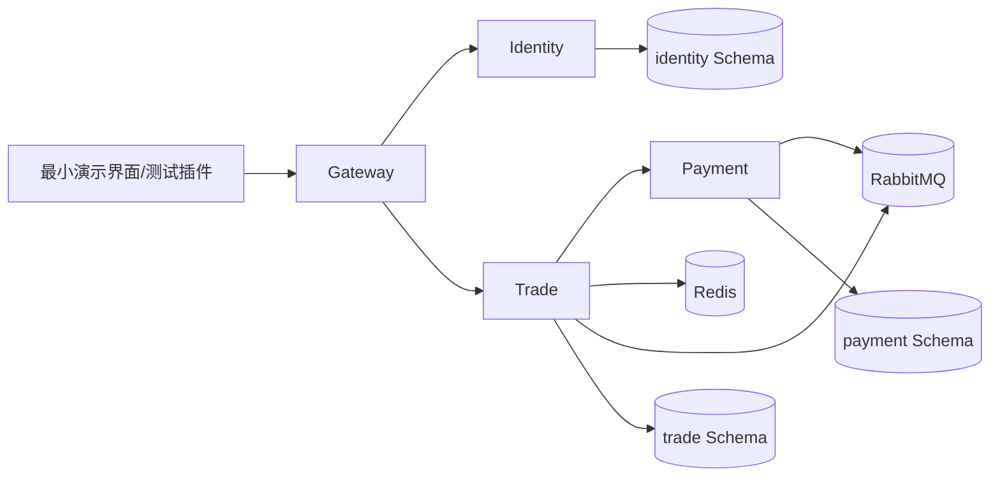
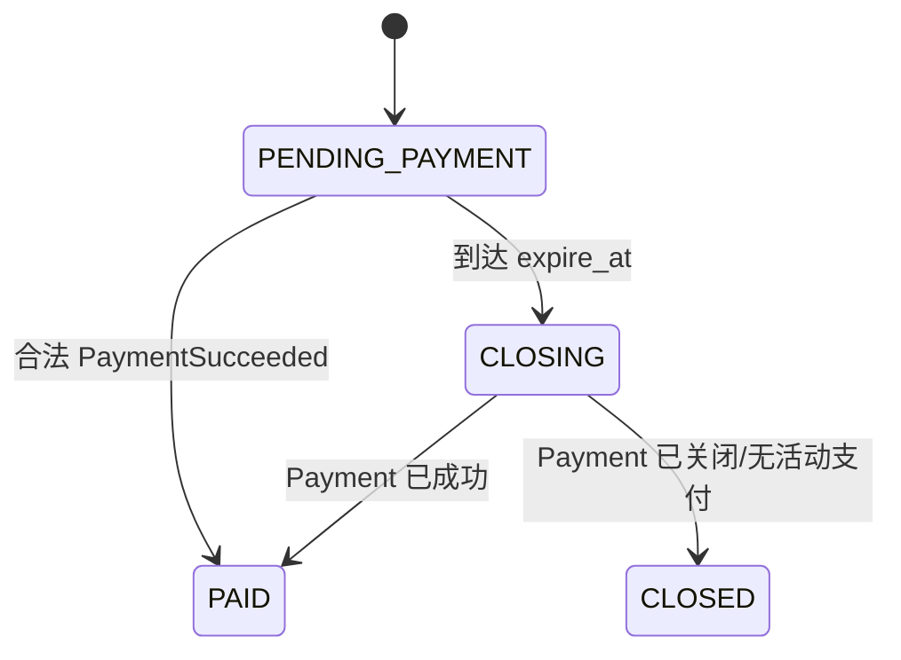
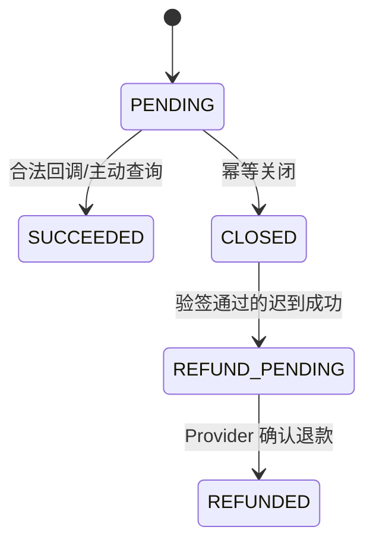
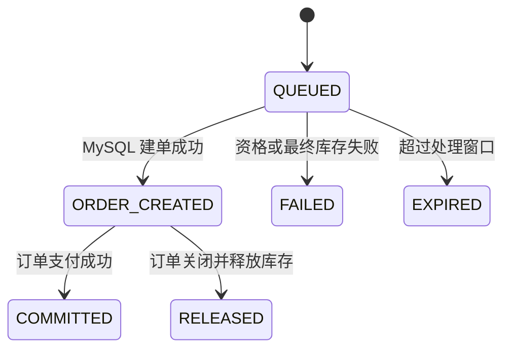

# LinkVerse 求职 MVP 开发步骤与注意事项

## 1. 文档目标与适用范围

本文用于指导在 `linkverse-platform/` 中从零实现 LinkVerse 求职 MVP。目标是在 **20 个工作日**内交付一个可启动、可测试、可故障复现的微服务交易闭环，重点证明：

1. 微服务边界清晰，服务不跨库写表；
2. 商品秒杀在并发、重复请求和依赖故障下不超卖；
3. 支付创建、异步回调、关单、补偿和对账具有明确保障机制。

本文是首个求职 MVP 的执行基线；`01-重构规划.md` 中的论坛、推荐和完整前端属于后续长期规划。为突出支付链路，MVP 将 Payment 从 Trade 中拆为独立服务；在恢复长期规划前，应通过 ADR 将该边界同步回其他设计文档。

### 1.1 完成定义

最终必须能连续演示以下闭环：

```text
登录 → 查看秒杀活动 → 提交预约 → 查询订单
     → 创建模拟支付 → 接收验签回调 → 查询已支付订单
     → 重放消息/回调及模拟故障 → 对账后数据收敛
```

简历中的性能和可靠性数字必须来自实际测试报告，并注明提交号、机器配置、容器资源、JVM 参数、数据量和压测脚本。

### 1.2 明确延期

- 论坛、聊天、Python 推荐、训练与行为数据；
- Elasticsearch、Kafka、Seata、Kubernetes 和 Service Mesh；
- 购物车、优惠券、多 SKU、物流、卖家后台和复杂售后；
- 真实资金支付、多渠道支付、部分退款和分账；
- Swagger/OpenAPI UI 及测试用 API 文档；
- 完整管理后台和精细化前端动效。

延期表示本期不实现，不表示从长期规划删除。

### 1.3 执行前提与文档覆盖关系

- 所有命令默认从仓库根目录执行，新工程固定创建在 `linkverse-platform/`；
- 不复制旧 Java/Python 模块，不依赖旧服务、旧 Schema 或旧运行环境；
- 阶段 0 开始前先阅读 `02-技术选型.md` 与 `03-业务规范.md`；
- 精确依赖版本、镜像补丁、摘要及前端工具版本统一锁定在 `linkverse-platform/infrastructure/versions.env` 和 Compose 文件中，二者是构建版本真值；
- 最小前端固定使用 Vue 3、TypeScript 与 Vite，具体版本随 `versions.env` 锁定。

MVP 的支付服务边界有意覆盖长期规划中的部分条款。出现冲突时，本文件对 MVP 实施具有优先级：

| 被覆盖文档 | MVP 覆盖内容 | 本期口径 |
|---|---|---|
| `01-重构规划.md` §4、§6 阶段 3B | 支付原属于 Trade | Payment 独立部署并独占 Payment Schema |
| `02-技术选型.md` §3.1、§5.1 | Trade 持有支付数据 | Trade 仅持有订单；Payment 持有支付与退款 |
| `03-业务规范.md` §2、§5.3、§7 第 4 条 | 支付尝试与订单同事务更新 | 两个本地事务通过 Outbox 事件衔接 |

支付成功的唯一实现口径是：

```text
Payment 本地事务：Payment Intent 条件迁移 + Payment Outbox
Trade 消费事务：consumed_event + 订单条件迁移
```

严禁为了复用旧条款引入跨 Schema 事务、跨服务写表或 Seata。MVP 完成后若继续长期规划，先通过 ADR 将最终边界回写到 01～03 文档。

## 2. MVP 架构与工程目录

### 2.1 部署单元

| 部署单元 | 职责 | 持有数据 |
|---|---|---|
| `linkverse-gateway` | 路由、请求 ID、JWT 初检、基础限流 | 无业务数据库 |
| `linkverse-identity` | 注册、登录、密码哈希、用户与服务令牌签发 | `identity` Schema |
| `linkverse-trade` | 商品、活动、库存、秒杀预约、订单、超时关单 | `trade` Schema、Trade Redis Key |
| `linkverse-payment` | Payment Intent、Mock Provider、回调、关闭、退款补偿、支付对账 | `payment` Schema |

Inventory、Order 和 Seckill 不再拆分服务。它们共享库存与订单的高频事务，放在 Trade 内可使用 MySQL 本地事务守住最终库存。Payment 独立后只能通过受认证 API 和事件与 Trade 协作，禁止直接修改订单表。



### 2.2 目标目录

```text
linkverse-platform/
├─ backend/
│  ├─ pom.xml
│  ├─ platform-core/
│  ├─ platform-starter-web/
│  ├─ platform-starter-security/
│  ├─ platform-starter-observability/
│  ├─ platform-starter-messaging/
│  ├─ linkverse-gateway/
│  ├─ linkverse-identity/
│  ├─ linkverse-trade/
│  └─ linkverse-payment/
├─ frontend/                       # 最小登录、秒杀、订单和支付状态页
├─ infrastructure/
│  ├─ compose/
│  ├─ mysql/
│  ├─ nacos/
│  └─ rabbitmq/
├─ tests/
│  ├─ load/
│  └─ fault/
└─ scripts/                        # 启动、造数、演示、对账和重放脚本
```

共享模块只放错误协议、安全适配、日志和消息信封等基础能力。禁止共享实体、Mapper、Repository 或领域服务，避免形成“分布式单体”。

后端统一使用 `ning.linkverse` groupId，artifactId、Nacos 服务名与上表部署单元一致。默认服务端口为 Gateway `18080`、Identity `18081`、Trade `18082`、Payment `18083`；若本机冲突，只能在阶段 0 的端口表中统一调整。

### 2.3 中间件基线

版本以 `02-技术选型.md` 为准：Java 21、Maven 3.9.x Wrapper、Spring Boot 3.5.15、MySQL 8.4、Redis 8.2、RabbitMQ 4.3 和 Nacos 3.2.3。开始编码前锁定具体镜像补丁与摘要，不使用 `latest`。

- MySQL：唯一业务事实源；本地可共用实例，但使用独立 Schema、账号和 Flyway 历史。
- Redis：限流、秒杀准入和可重建状态；不得作为最终库存或订单事实。
- RabbitMQ：秒杀削峰和领域事件；采用至少一次投递，不宣称 exactly-once。
- Nacos：MVP 仅用于注册发现；密钥、支付私钥和数据库密码不得进入 Nacos 明文。
- 可观测性：结构化日志和 Actuator 指标必做；完整 OTLP/Grafana 通过可选 Compose profile 启用。

命名空间建议固定为 `linkverse-mvp`，RabbitMQ 使用独立 vhost，Redis Key 使用 `lv:mvp:{domain}:...` 前缀。

## 3. 开工前必须冻结的不变量

以下不变量应先写成测试名称，再实现业务代码：

- 数据库可售库存始终不小于 0；
- 同一用户对同一活动最多产生一个有效预约或订单；
- 同一 `reservation_no` 最多扣减一次、最多释放一次库存；
- Redis 准入成功只表示“已排队”，不表示订单或支付成功；
- 商品名称、单价、总金额和币种由服务端生成并保存快照；
- 客户端价格、用户 ID、订单状态和支付结果均不可信；
- 同一幂等键、事件、回调和渠道流水重复到达，不重复产生副作用；
- 订单只有在合法且金额匹配的支付事实到达后才能变为 `PAID`；
- 已支付订单不能被超时任务关闭，已关闭订单不能被普通回调重新打开；
- MySQL 提交、消息发布和消费 ACK 任一位置宕机后，系统可通过重试或对账收敛；
- 服务只写自己的 Schema，不跨 Schema Join，不共享数据库实体。

金额使用 `DECIMAL(19,4)` 和 `BigDecimal`，禁止 `float` 或 `double`。所有状态更新必须带前置状态条件并检查受影响行数。

## 4. 最小数据、接口与事件

### 4.1 最小表

| Schema | 表 | 关键约束 |
|---|---|---|
| Identity | `user_account` | 用户名、邮箱按实际登录方式唯一；密码只存强哈希 |
| Identity | `auth_client` | OAuth2 客户端 ID 唯一；凭证只存摘要 |
| Trade | `book_listing`、`sku_stock` | 库存版本；可售库存非负 |
| Trade | `trade_order`、`order_item` | 订单号唯一；`(user_id,idempotency_key)` 唯一；`reservation_id` 可空且唯一 |
| Trade | `seckill_campaign` | 活动、专用 SKU、版本和时间窗索引 |
| Trade | `seckill_reservation` | `reservation_no`、`(campaign_id,user_id)` 唯一 |
| Trade | `outbox_event`、`consumed_event` | `event_id`、`(consumer_name,event_id)` 唯一 |
| Payment | `payment_intent` | `intent_no`、`order_no` 唯一；`(provider,provider_txn_no)` 唯一 |
| Payment | `payment_callback_log` | 通过验签后才以 `(provider,notification_id)` 占用唯一键 |
| Payment | `payment_exception`、`refund_attempt` | 异常号、退款请求号唯一；退款幂等 |
| Payment | `outbox_event` | `event_id` 唯一；支付事实与事件同事务 |

MVP 只支持一个 Mock Provider 和每张订单一个 `payment_intent`。它是一单唯一的支付聚合，不等同于可重复创建的渠道“支付尝试”；多次渠道尝试作为后续子表扩展。

### 4.2 最小外部接口

| 接口 | 调用方与鉴权 | 幂等及最小结果 |
|---|---|---|
| `POST /api/v1/auth/register`、`/login` | 匿名用户 | 注册按账号唯一；登录返回用户 JWT |
| `GET /api/v1/listings/{listingId}`、`/seckill/campaigns/{campaignId}` | 用户 JWT | 返回服务端商品、活动和时间窗 |
| `POST /api/v1/seckill/campaigns/{campaignId}/reservations` | 用户 JWT、`Idempotency-Key` | `202` 返回 `reservation_no/status`；重复请求返回原预约 |
| `GET /api/v1/seckill/reservations/{reservationNo}` | 预约所有者 | 返回 `reservation_no/status/order_no/failure_code` |
| `POST /api/v1/orders` | 用户 JWT、`Idempotency-Key` | `201` 新建、重复时返回原订单、库存不足为 `409` |
| `GET /api/v1/orders/{orderNo}` | 订单所有者 | 返回服务端订单状态与金额快照 |
| `PUT /api/v1/orders/{orderNo}/payment-intent` | 订单所有者 | 一单一个 Intent；已关闭返回 `409` |
| `GET /api/v1/payment-intents/{intentNo}` | Intent 所有者 | Payment 直接返回支付/退款状态 |
| `POST /api/v1/mock-provider/payment-intents/{intentNo}/confirm` | 仅 `local/test`、Intent 所有者 | 生成签名并触发真实回调代码路径 |
| `POST /api/v1/payments/callbacks/mock` | Provider 签名 | 事务提交后返回成功；合法重复回调仍返回成功 |

预约排队期间，查询接口在 MySQL 无终态记录时读取 Redis；一旦 MySQL 存在预约记录，MySQL 永远优先。成功结果通过同 Schema 关联返回唯一 `order_no`。

#### 内部支付接口

| 接口 | 调用方与鉴权 | 请求与结果 |
|---|---|---|
| `POST /oauth2/token` | Trade 使用 `client_credentials` | Identity 签发 `aud=linkverse-payment` 的短期服务 JWT |
| `POST /internal/v1/payment-intents` | Trade 服务 JWT | 携带订单号、用户、金额、币种、商户、过期时间；`Idempotency-Key=order_no` |
| `PUT /internal/v1/payment-intents/{orderNo}/close` | Trade 服务 JWT | 幂等返回 `CLOSED`、`SUCCEEDED` 或当前退款终态 |
| `GET /internal/v1/payment-intents/by-order/{orderNo}` | Trade 服务 JWT | 仅用于恢复与对账，不暴露给用户 |

Payment 必须验证 `iss`、`aud`、`exp` 和客户端主体；用户 JWT 不能调用内部接口。同步超时后的重试必须复用同一订单号和幂等键。

商品、库存和活动使用 Flyway 演示数据初始化，不建设管理端 CRUD。仓库内自动化测试和脚本是正式验收入口；用户指定插件只用于人工调试。项目不引入 Swagger，也不额外生成测试 API 文档。

### 4.3 最小状态机







`refund_attempt` 使用 `REQUESTED -> PROCESSING -> SUCCEEDED` 状态机；调用结果未知时进入 `UNKNOWN`，只能通过同一退款请求号主动查询或幂等重试。明确拒绝才进入 `FAILED`，不得把网络超时当成退款失败。

### 4.4 事件信封

所有消息统一使用 snake_case 信封，至少包含 `event_id`、`event_type`、`schema_version`、`aggregate_id`、`occurred_at`、`trace_id` 和最小业务快照。

| 事件 | 生产者 → 消费者 | 幂等键与副作用 |
|---|---|---|
| `PaymentSucceeded` | Payment → Trade | `intent_no`；复核订单号、金额和币种后将订单置为 `PAID` |
| `PaymentClosed` | Payment → Trade | `order_no`；同步响应丢失时恢复 `CLOSING -> CLOSED` |
| `SeckillRequested` | Trade API → Trade Worker | `reservation_no`；创建订单或持久化业务失败 |
| `SeckillReservationSucceeded` | Trade Worker → Redis 投影器 | `reservation_no`；确认终态并移除待发布记录 |
| `SeckillReservationRejected` | Trade Worker/过期扫描 → Redis 补偿器 | `reservation_no`；条件恢复库存但保留用户标记 |
| `SeckillStockReleased` | Trade 关单 → Redis 补偿器 | `reservation_no`；活动仍有效时条件恢复镜像库存 |

迟到支付、退款请求和退款结果均由 Payment 在本领域内处理并对账，不创建无人消费的跨服务事件。

不同消费者使用独立 Queue；不得让两个服务竞争消费同一业务 Queue，也不得依赖 RabbitMQ 的全局顺序。

## 5. 20 个工作日开发步骤

| 工作日 | 当日唯一主目标 | 必须通过的日门禁 |
|---|---|---|
| D1 | 范围、版本、边界、状态机和 ADR | 无未决核心边界 |
| D2 | Maven Reactor、BOM、Wrapper 和服务骨架 | 全模块可编译 |
| D3 | Compose、Schema、Gateway、日志和健康检查 | 四服务健康、账号隔离 |
| D4 | 用户注册、登录和用户 JWT | 正常与伪造令牌测试通过 |
| D5 | `client_credentials` 和资源服务二次验签 | Trade 可认证调用 Payment |
| D6 | 商品、专用 SKU、库存及 Flyway | 迁移可在空库执行 |
| D7 | 幂等普通下单和库存条件更新 | 重复请求及最后一件测试通过 |
| D8 | 订单查询、过期扫描框架和并发回归 | 普通交易正确性门禁通过 |
| D9 | Payment Intent 与 Mock Provider | 创建/关闭并发可幂等 |
| D10 | 回调验签、最小 Outbox Relay、支付事件 | 重复/伪造回调测试通过 |
| D11 | 关单、迟到支付、退款和对账 | 支付—关单竞态测试通过 |
| D12 | 活动、Redis Lua 和稳定预约事件 | 原子准入与一人一次通过 |
| D13 | MQ Worker、MySQL 建单和业务失败墓碑 | 重投及 ACK 窗口测试通过 |
| D14 | Redis 投影、补偿、对账和基础压测 | 专用 SKU 无超卖 |
| D15 | Outbox/消费重试、停车和重放 | Broker 故障后可恢复 |
| D16 | 日志、指标及三方对账 | 差异可定位、敏感信息脱敏 |
| D17 | Testcontainers 集成测试 | 自动化主套件稳定通过 |
| D18 | failpoint、并发和故障注入 | 全部硬性场景收敛 |
| D19 | 最小前端、脚本、README 和报告 | 第三方可按文档演示 |
| D20 | 干净环境复验和版本冻结 | 无阻断缺陷，证据完整 |

### 阶段 0：范围冻结（第 1 日）

#### 开发任务

1. 确认仓库根目录和全新 `linkverse-platform/` 边界，禁止复制旧模块。
2. 阅读 02、03 文档，将精确依赖、镜像及前端工具版本写入 `versions.env`。
3. 固定四个部署单元、三个 Schema、Redis 前缀和 RabbitMQ vhost。
4. 画出订单、支付、退款和秒杀预约状态机。
5. 固定最小接口、表、事件、不变量和延期清单。
6. 编写 Payment 独立服务 ADR，说明同步调用、事件和故障边界。
7. 把最终验收场景先登记为待实现测试。

#### 交付物与验收

- 一页范围清单、服务数据所有权表、状态机和验收矩阵；
- `versions.env`、端口表、服务 artifactId/groupId 和 ADR 路径已冻结；
- 每张表只有一个写入服务；
- 论坛、推荐、聊天、ES 等没有进入本期任务；
- 不存在“基本正常”“保证高并发”等不可测表述。

#### 注意事项

当天不写业务 Controller。状态机和不变量未确认前，不设计表字段和接口返回结构。

### 阶段 1：工程骨架与基础设施（第 2～3 日）

#### 开发任务

1. 新建 Maven Reactor、Wrapper、BOM 和四个服务骨架。
2. 建立 `platform-core` 及 Web、安全、观测、消息 Starter；保持依赖单向。
3. 使用 Docker Compose 启动 MySQL、Redis、RabbitMQ 和 Nacos。
4. 创建独立 Schema、最小权限账号和 Flyway 基线。
5. 实现统一中文错误响应、请求 ID、结构化日志、脱敏和健康检查。
6. 配置 Gateway 路由、Nacos 注册发现和本地跨域白名单。

#### 交付物与验收

- `docker compose config` 校验通过，一条命令可启动中间件；
- `.\mvnw.cmd clean verify` 通过，四个服务的 `/actuator/health` 为健康；
- Gateway 可按服务名路由；
- 各服务账号连接其他 Schema 时被拒绝；
- `.env.example` 仅含占位符，仓库扫描不到真实凭证。

#### 注意事项

- 不引入业务大 `common`、ES、Seata、Kafka 或 Sentinel；
- 配置中明确连接、读取、事务和消息超时，禁止无限重试；
- Compose 数据卷、网络和容器名带 MVP 前缀，避免污染旧环境；
- Flyway 迁移只追加，不修改已经执行的版本。

### 阶段 2：身份认证与服务安全（第 4～5 日）

#### 开发任务

1. 使用 Spring Authorization Server 实现最小注册、登录、密码强哈希和 `client_credentials`。
2. 使用非对称密钥签发 JWT，包含 `iss`、`aud`、`sub`、`exp`、`jti`。
3. Gateway 预校验；Identity、Trade 和 Payment 各自再次验签和校验受众。
4. 区分用户令牌与服务令牌；Trade 调用 Payment 使用独立服务身份。
5. 外部支付回调使用 Provider 签名规则，不要求用户 JWT。

#### 交付物与验收

- 注册、登录、服务令牌和公钥配置；
- 伪造、过期、错误签发者和错误受众令牌全部被拒绝；
- 绕过 Gateway 直连资源服务仍不能伪造用户；
- 用户令牌不能调用 Payment 内部接口；
- 密码、令牌、私钥和完整 Authorization Header 不进入日志。

#### 注意事项

不实现第三方登录、Consent 页面、复杂 RBAC 和刷新令牌轮换。用户 ID 只能从已验证令牌取得，不能采用请求体字段。

### 阶段 3：普通交易正确性（第 6～8 日）

#### 开发任务

1. 建立商品、库存、订单和订单项迁移，初始化少量固定演示数据。
2. 实现商品查询和“立即购买”，只支持单商品、单数量。
3. 接收 `Idempotency-Key`，由唯一约束返回同一业务结果。
4. 在一个 Trade 本地事务内：
   - 使用 `UPDATE ... WHERE available >= 1` 条件扣库存；
   - 创建订单与不可变价格快照。
5. 建立订单查询和 `expire_at` 扫描框架。
6. 补齐重复请求、最后一件库存、事务回滚和并发下单测试。

#### 交付物与验收

- 同一用户、同一幂等键只产生一个订单；
- 多线程购买最后一件库存时成功订单不超过一个，库存不为负；
- 任一步骤失败时，订单和库存同时回滚；
- 商品修改不影响既有订单快照；
- 普通下单不依赖 Redis 和 RabbitMQ 可用性。

#### 注意事项

不要“先查库存再无条件更新”，不要在线程池中修改库存，也不要让客户端提交可信价格。此阶段先证明 MySQL 事务正确，再添加秒杀准入。

### 阶段 4：独立支付链路（第 9～11 日）

#### 第 9 日：支付创建

1. 创建 Payment Schema、`payment_intent`、回调、退款和 Outbox 表。
2. 定义 Provider 的 create、verifyCallback、query、close、refund 接口，只实现一个带签名的 Mock Provider。
3. 客户端请求 Trade 创建支付；Trade 校验订单所有者、状态、金额和过期时间后，以服务身份调用 Payment。
4. Payment 按订单号幂等创建 Intent，保存金额、币种、商户和 Provider 快照。算法固定为：
   - 直接尝试插入 `PENDING`，禁止先查询后插入；
   - 遇到订单号重复时重新读取；
   - `PENDING/SUCCEEDED` 返回原结果；
   - `CLOSED/REFUND_PENDING/REFUNDED` 拒绝创建。
5. 同步调用设置短超时；未知结果只能携带相同幂等键进行有限重试。

**验收：** 重复创建返回原 Intent；创建与关闭并发时没有 500 或重复记录；客户端篡改金额无效；Payment 不访问 Trade 表。

#### 第 10 日：回调与支付事件

1. Mock Provider 按固定规范对原始请求字节生成 HMAC 签名和渠道流水号。
2. 回调先做大小限制和限流，再校验签名、时间戳、商户、订单、金额、币种。
3. 只有验签及业务复核通过后，才用通知 ID 和渠道流水唯一约束占用幂等键；非法请求只进入有界安全日志。
4. 在同一 Payment 事务内插入已验签回调日志、执行 `PENDING -> SUCCEEDED`，并写 `PaymentSucceeded` Outbox。
5. 本日在 `platform-starter-messaging` 实现可复用的最小 Outbox Relay（扫描、抢占、Publisher Confirm、成功标记和同事件 ID 重发），并先在 Payment 启用。
6. 事务提交后才返回 Provider 成功响应。
7. Trade 在同一事务内写消费去重记录、复核订单号/金额/币种、条件更新订单；秒杀订单同时将预约置为 `COMMITTED`，提交后 ACK。

**验收：** 同一回调重放 100 次只发生一次有效状态迁移；错误签名、商户、金额或币种全部拒绝；浏览器回跳不能改变状态。

#### 第 11 日：关单竞态、补偿与对账

1. Trade 扫描过期订单，先执行 `PENDING_PAYMENT -> CLOSING`，阻止新的支付创建。
2. Trade 携带订单号、用户、金额、币种、商户和过期时间快照，幂等调用 Payment 关闭。Payment 算法固定为：
   - 直接尝试插入带完整快照的 `CLOSED` 墓碑，并在同事务写 `PaymentClosed` Outbox；
   - 遇到订单号重复时执行 `PENDING -> CLOSED` 条件更新；更新成功时同事务写 `PaymentClosed` Outbox；
   - 更新失败后重新读取；`SUCCEEDED` 返回成功事实，其他终态返回原结果；
   - 禁止先查询不存在再插入。
3. Trade 按 Payment 当前结果处理：`CLOSED` 时执行 `CLOSING -> CLOSED` 并在同一事务恢复库存；`SUCCEEDED` 时执行 `CLOSING -> PAID` 且不释放；`REFUND_PENDING` 时保持 `CLOSING` 且不释放；`REFUNDED` 时才关闭并释放。
4. `PaymentClosed` 事件只用于唤醒同步响应丢失后的恢复；Trade 收到后先查询 Payment 当前状态，再按第 3 条分支，禁止依据可能过期的事件快照直接释放库存。
5. `CLOSING` 扫描器每 5 秒使用同一幂等键查询/重试；2 分钟仍未知则告警并保留占用，禁止猜测关闭或释放库存。
6. 验签通过的迟到成功不重开订单。在一个 Payment 事务内保存渠道流水和实际成功时间，将 Intent 置为 `REFUND_PENDING`，写 `payment_exception` 并幂等创建 `refund_attempt`。
7. 退款 Worker 使用固定退款请求号调用 Provider；未知结果主动查询，明确成功后将 Intent 置为 `REFUNDED`。
8. 实现订单—支付—退款对账任务。

**验收：** 支付成功与关单并发执行时最终只能选择合法分支；不会出现 `PAID -> CLOSED`；迟到成功具有可查询的异常和补偿记录。

#### 支付注意事项

- Mock 入口仅存在于 `local/test` profile，生产构建默认关闭；
- 不记录支付回调原文、密钥、令牌和完整支付参数；
- 不对非幂等支付写请求做无界自动重试；
- 真实渠道的关闭语义必须重新评审，Mock 结果不得包装成真实资金经验。

### 阶段 5：商品秒杀（第 12～14 日）

#### 第 12 日：活动与 Redis Lua 准入

1. 创建活动和预约表，初始化一个固定活动和专用 SKU；活动期间普通下单接口拒绝该 SKU。
2. 活动发布时加载版本、起止时间、限购和库存镜像。
3. 服务端生成稳定 `reservation_no` 和 `event_id`；Lua 将二者和事件载荷摘要一起持久化，并原子完成：
   - 活动与版本校验；
   - 一人一单快速去重；
   - 库存镜像预减；
   - 预约状态写入；
   - 将预约加入待发布有序集合。
4. 多 Key 使用同一 Cluster Hash Tag；过期时间覆盖活动、支付期限和对账窗口。

**验收：** 并发 Lua 测试不会把 Redis 库存扣成负数；同一用户在活动内永久只有一次预约尝试，不因失败重新获得资格；返回值明确为“排队中”。

#### 第 13 日：RabbitMQ 与 MySQL 最终建单

1. HTTP 线程使用 Redis 中已保存的固定 `event_id` 和载荷发布 `SeckillRequested`。
2. Publisher Confirm 后将预约标记为已发布；确认未知时允许重发。
3. 定时扫描长期待发布预约并重投，解决 Lua 成功后进程宕机的窗口。
4. Trade 消费者在一个 MySQL 事务内：
   - 插入消费去重记录；
   - 幂等插入预约；若已存在则读取并校验终态；
   - 只处理当前活动版本且非 `FAILED/EXPIRED` 墓碑的预约；
   - 条件扣减权威库存；
   - 创建订单和订单项；
   - 将预约置为 `ORDER_CREATED` 并关联唯一订单；
   - 写 `SeckillReservationSucceeded` Outbox。
5. 事务提交后 ACK；重复事件直接返回原结果。
6. 最终库存不足属于可提交的业务失败：同一事务保存消费记录、`FAILED` 预约和 `SeckillReservationRejected` Outbox；只有技术异常才回滚并有限重试。
7. Trade 启用第 10 日的同一最小 Outbox Relay，确保成功/拒绝事件可在第 14 日被投影器消费。

**验收：** 同一事件重投 10 次只建一单；消费者在提交后、ACK 前宕机，重启后无重复副作用。

#### 第 14 日：补偿、对账与基础压测

1. Confirm 未知只保持 `PUBLISH_PENDING` 并用同一 `event_id` 重投，禁止据此补偿。
2. 明确不可路由或到达终止窗口时，必须先在 MySQL 插入 `FAILED/EXPIRED` 墓碑和拒绝 Outbox；迟到消费者读到墓碑后直接 ACK。墓碑插入遇唯一键冲突时重新读取：现有状态为 `ORDER_CREATED/COMMITTED/RELEASED` 时禁止覆盖和补偿，已有失败终态时幂等返回。只有墓碑新建成功或确认已存在失败终态时，才允许恢复 Redis。
3. 迟到的 Publisher Confirm 只能条件执行 `PUBLISH_PENDING -> PUBLISHED`；预约已为失败或成功终态时不得覆盖。
4. Redis 投影器消费成功/拒绝事件。补偿 Lua 必须校验预约号、活动版本和当前状态，幂等恢复镜像库存但保留用户标记；禁止裸 `INCR`。
5. 实现三类差异扫描：
   - Redis 已预扣、MySQL 无预约；
   - MySQL 已成功、Redis 未确认；
   - 预约长期处于中间态。
6. 秒杀订单关闭时，在恢复 MySQL 库存的同一事务将预约置为 `RELEASED` 并写 `SeckillStockReleased` Outbox；投影器仅在活动版本仍有效时恢复 Redis 镜像。
7. Redis 或 RabbitMQ 不可用时快速关闭新秒杀请求，已预扣预约仍由扫描器收敛；普通下单继续可用。
8. 运行专用 SKU 库存 100、至少 1000 个独立用户的并发测试。

**验收：** 最终订单不超过 100、无一人多单、库存不为负；无注入故障时成功订单为 100；故障场景对账后满足“剩余库存 + 有效占用/订单 = 初始库存”。

#### 秒杀注意事项

- Redis 只是准入层，MySQL 条件更新和唯一约束是最终防线；
- 初始化任务不得在应用重启时覆盖进行中的 Redis 库存；
- 不使用 Redis 分布式锁包围下单事务；
- TTL 和 Keyspace Notification 不能作为唯一补偿机制；
- `(campaign_id,user_id)` 表示活动内永久一次尝试；补偿库存时不删除用户标记；
- 失败重试必须有上限，不可无限 `requeue`。

### 阶段 6：可靠性与可观测性收口（第 15～16 日）

#### 开发任务

1. 在已由 Payment、Trade 启用的最小 Relay 基础上，只增强统一抢占、退避重试、停车和崩溃恢复规则。
2. Outbox 记录状态、尝试次数、下次重试时间和最后错误；确认不确定时允许重发。
3. 消费去重和业务更新必须位于同一事务；确需发布后续事件时，消费端 Outbox 也进入该事务，提交后手动 ACK。
4. 配置有限次数指数退避；不可重试错误和超限消息进入停车队列。
5. 提供按事件 ID 查询和人工重放脚本；重放前必须先修复原因。
6. 完成订单、秒杀、支付和 Outbox 对账，定义差异类型、补偿动作和最大收敛时间。
7. 增加业务指标和关联日志。

#### 必须观测的字段与指标

日志字段至少包含 `service`、`trace_id`、`request_id`、`event_id`、`reservation_no`、`order_no`、`intent_no` 和 `error_code`。敏感值只记录摘要或脱敏值。

指标至少包含：

- 秒杀请求、准入、售罄、拒绝和处理中数量；
- 订单创建、关闭、支付成功及处理延迟；
- 回调验签失败、重复通知、金额不匹配和迟到成功数量；
- `CLOSING` 超时、退款未知和待人工处理数量；
- Outbox 未发送数量、最老消息年龄、重试次数和停车队列数量；
- Redis/MySQL 库存差异与对账未解决数量。

#### 验收

- RabbitMQ 中断后恢复，Outbox 积压最终清零；
- 重复消息不改变最终结果，毒消息不会阻塞正常消息；
- 日志可从 HTTP 请求关联到订单、支付和事件；
- 对账不静默覆盖未知异常，而是输出明确的人工处理项。

### 阶段 7：自动化测试、前端与求职交付（第 17～20 日）

#### 第 17 日：集成测试

- 使用 JUnit 5、Spring Boot Test、Testcontainers 和 WireMock；
- 单元测试命名 `*Test`，跨组件测试命名 `*IT`；
- 使用 Testcontainers/Toxiproxy 覆盖数据库约束、事务回滚、Redis Lua、RabbitMQ 重投和 Provider 回调；
- 在 `test` profile 提供可控 barrier/failpoint，生产构建关闭，用于稳定命中提交、发布和 ACK 边界。

#### 第 18 日：故障与并发测试

至少执行：

| 场景 | 硬性结果 |
|---|---|
| 库存 100、1000 个用户抢购 | 最终成功订单 100，超卖 0 |
| 同一用户并发提交 100 次 | 最多一个有效预约或订单 |
| 同一消息重投 10 次 | 业务副作用一次 |
| 同一成功回调重放 100 次 | 支付和订单各迁移一次 |
| 错误签名、商户、金额、币种 | 全部拒绝，订单不变 |
| 支付成功与关单并发至少 1000 轮 | 只有合法终态，无已支付后关单 |
| 支付创建与关闭并发至少 1000 轮 | 每单一个 Intent，无 500 和后建支付 |
| 迟到支付及退款结果未知 | 订单不重开，退款可查询并最终收敛 |
| MySQL 已提交、MQ 未发送 | Broker 恢复后 Outbox 可送达 |
| 消费事务提交、ACK 前宕机 | 重投后无重复业务数据 |
| Redis 已预扣、进程宕机 | 扫描后重投或安全释放 |
| 毒消息 | 进入停车队列，不阻塞正常消息 |

权威库存断言固定为：`初始库存 = MySQL 可售库存 + 状态为 PENDING_PAYMENT/CLOSING/PAID 的订单数量`。投影稳定后还应满足 `MySQL 可售库存 = Redis 镜像库存`；处理中允许的差额只能等于尚未落库的 Redis 预约数。

性能目标仅作为优化方向：秒杀入口持续 1000 RPS、p95 小于 100 ms、p99 小于 200 ms，准入到订单可查询 p99 小于 3 秒。未实测达成前不得写入简历。

#### 第 19 日：最小前端与演示材料

只实现登录、活动/商品展示、秒杀提交、排队结果、订单状态、模拟支付和最终状态页面。前端轮询只查询服务端状态，不能推进支付或订单状态。

同时固定以下仓库入口，脚本必须从自身位置解析仓库根：

- `scripts/start.ps1`：启动中间件、四服务和前端并等待健康；
- `scripts/seed.ps1`：重置专用活动、生成用户和临时令牌；
- `scripts/verify.ps1`：运行构建、单元与集成测试；
- `scripts/fault-test.ps1`：运行重复、宕机、网络和竞态场景；
- `scripts/reconcile.ps1`：输出订单、支付、退款和库存差异；
- `scripts/acceptance.ps1`：依次编排 seed、verify、fault-test 和 reconcile，任一步失败即非零退出；
- `scripts/replay.ps1 -EventId <id>`：修复原因后重放停车消息；
- `scripts/clean.ps1`：确认后仅清理 `linkverse-mvp-*` 本地资源；
- README、架构图、秒杀和支付时序图；
- 压测原始数据、汇总报告和已知限制统一输出到 `linkverse-platform/artifacts/`；
- 3～5 分钟演示顺序：正常闭环 → 重复回调 → 消费者重启 → 对账收敛。

#### 第 20 日：干净环境验收与版本冻结

1. 在全新目录克隆仓库；
2. 只按 README 配置占位环境变量；
3. 启动中间件、执行迁移、构建并启动服务；
4. 运行 `scripts/acceptance.ps1`，覆盖自动化、并发、故障和对账门禁；
5. 连续完成三次演示；
6. 修复阻断问题并打 MVP 标签。

任何简历描述必须能指向代码、自动化测试或报告。不得使用“绝对一致”“零丢失”“海量并发”“生产级高可用”等无法证明的词。

## 6. 每日完成定义

每天结束前必须满足：

- 主分支或当前功能分支可编译，`.\mvnw.cmd clean verify` 通过；
- 新增行为至少有正常、重复和一个失败路径测试；
- 数据库变化只通过新的 Flyway 迁移完成；
- 新写接口明确幂等键、唯一约束和重试结果；
- 新异步流程明确超时、重试、补偿、停车和对账；
- 事务位于 application 层，领域对象不依赖 Spring、MyBatis、Redis 或 MQ；
- 代码注释使用中文，只解释不变量、取舍和反直觉原因；
- 错误提示使用中文，日志不泄漏实现堆栈和敏感数据；
- 文档、配置示例和演示步骤与代码同步；
- 提交保持单一目的，例如 `feat(trade): 实现幂等创建订单`。

以下命令均从仓库根目录执行；成功退出码必须为 0：

| 用途 | 命令 | 主要产物 |
|---|---|---|
| 校验 Compose | `docker compose -f linkverse-platform/infrastructure/compose/compose.yml config` | 标准输出，无配置错误 |
| 启动完整环境 | `.\linkverse-platform\scripts\start.ps1` | 四服务和前端健康 |
| 初始化演示/压测数据 | `.\linkverse-platform\scripts\seed.ps1 -Users 1000 -Stock 100` | 临时令牌与活动摘要，目录已被 Git 忽略 |
| 后端全量验证 | `Set-Location linkverse-platform/backend; .\mvnw.cmd clean verify` | Surefire/Failsafe 报告 |
| 基础验证 | `.\linkverse-platform\scripts\verify.ps1` | `artifacts/tests/` |
| 并发与故障测试 | `.\linkverse-platform\scripts\fault-test.ps1` | `artifacts/fault/`、`artifacts/load/` |
| 对账 | `.\linkverse-platform\scripts\reconcile.ps1` | `artifacts/reconcile/` |
| 完整一键验收 | `.\linkverse-platform\scripts\acceptance.ps1` | 汇总上述报告；任一门禁失败则退出码非 0 |

k6 的精确版本随 `versions.env` 锁定，压测脚本必须自行准备活动窗口和临时令牌，并以断言失败的非零退出码阻止误报。

## 7. 进度风险与裁剪顺序

进度落后时，按以下顺序裁剪：

1. 前端视觉细节，保留最小页面；
2. Grafana 仪表盘，保留指标端点和结构化日志；
3. 用户刷新令牌与复杂权限；
4. 支付主动查询页面，保留后台任务；
5. 用户主动退款，保留迟到支付自动补偿；
6. 普通订单的多数量能力，退回单商品单数量；
7. Nacos 动态配置，仅保留注册发现。

不得裁剪：

- Payment 独立数据边界与服务身份；
- MySQL 条件扣库存和数据库唯一约束；
- HTTP、回调和消费幂等；
- 支付验签、商户/订单/金额/币种复核；
- Outbox、提交后 ACK、有限重试和停车队列；
- 支付关闭竞态与迟到支付补偿；
- 秒杀发布失败补偿和数据对账；
- 并发、重复消息、伪造回调及宕机测试。

若第 14 日仍未打通支付和秒杀主链路，应停止新增观测界面和前端细节，优先修复一致性与测试；不能通过删除保障机制换取表面演示成功。

## 8. 最终验收清单

### 工程与边界

- [ ] 四个部署单元可独立构建和启动；
- [ ] 一个命令启动最小中间件，版本均已锁定；
- [ ] 服务数据库账号隔离，无跨 Schema 写入或 Join；
- [ ] 无旧工程运行时依赖，无真实密钥入库；
- [ ] Swagger、ES、Python、论坛和聊天未进入 MVP。

### 普通交易与秒杀

- [ ] 价格来自服务端快照，库存条件更新无负数；
- [ ] 重复请求与消息不重复扣库存或建单；
- [ ] Redis 准入与 MySQL 最终库存职责清晰；
- [ ] Redis/MQ 故障时秒杀失败关闭，普通下单仍可用；
- [ ] 预约扫描、幂等补偿和对账均有测试证据。

### 支付

- [ ] 用户不能提交可信金额或直接更新支付状态；
- [ ] Trade 使用服务身份调用 Payment；
- [ ] 回调验签并复核商户、订单、金额和币种；
- [ ] 通知、渠道流水和支付成功事件均可幂等重放；
- [ ] 关单与支付成功竞态只有合法结果；
- [ ] 迟到支付进入异常、补偿与对账，不重开订单。

### 可靠性、安全与展示

- [ ] Outbox 可恢复投递，消费者事务提交后 ACK；
- [ ] 重试有上限，毒消息可停车和人工重放；
- [ ] 日志、指标和对账可定位具体业务对象；
- [ ] 令牌、密钥和支付敏感信息未进入代码或日志；
- [ ] 干净环境可复现启动、测试和完整演示；
- [ ] 简历中的每个数字和技术声明均有可核验证据。
