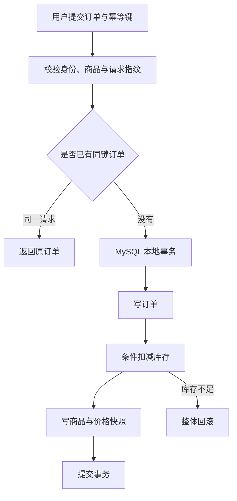
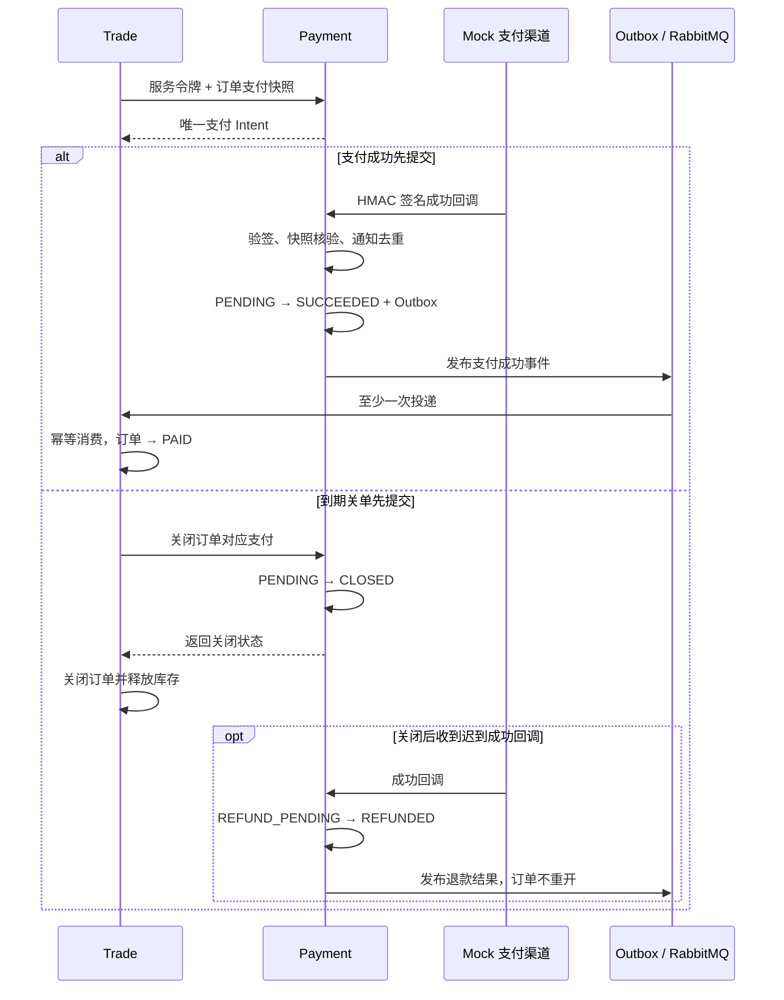
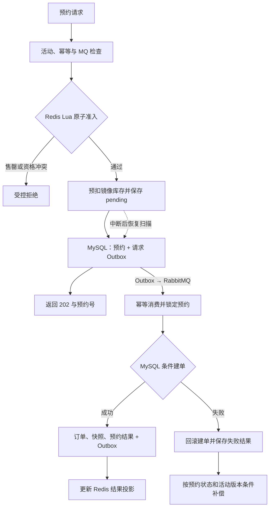

# LinkVerse 交易、支付与秒杀

## 设计目标

交易链路首先保证金额、库存和状态正确，再通过 Redis 与 RabbitMQ 提升高并发入口的处理能力。MySQL 保存最终事实；每个写请求都具有幂等语义、事务边界和失败恢复路径。

> 当前支付渠道采用 Mock 实现，用于模拟回调、关单和退款流程，尚未接入真实支付渠道。

## 普通下单

用户创建订单时提供 `Idempotency-Key`。Trade 以用户、商品和数量生成请求指纹，相同用户和幂等键只有在请求内容一致时才返回原订单；相同键对应不同请求会被拒绝。

库存通过 `available >= quantity` 条件更新扣减，避免先查询再无条件修改。订单保存标题、卖家、金额和币种快照，后续商品信息变化不会改写历史订单。金额使用 `BigDecimal` 与数据库 `DECIMAL`，客户端价格不参与最终结算。

## 支付链路

每个订单对应唯一支付 Intent。Trade 把服务端订单快照交给 Payment，Payment 校验订单、买家、商户、金额、币种与过期时间，并独立保存支付状态。

### 回调安全与幂等

Mock 渠道回调对原始请求体和时间戳执行 HMAC 校验。合法回调还需核对通知号、订单、商户、金额、币种和目标状态；通知号和报文摘要共同参与去重。状态更新采用带前置状态的条件迁移，重复回调可以返回已有结果，不会重复产生支付事实。

### 支付与关单竞态

支付成功先提交时，后续关单读取已成功状态，Trade 将订单收敛为已支付。关单先提交时，订单关闭并释放库存；迟到的支付成功不会重新打开订单，而是进入退款补偿。远程调用失败时不直接认定未支付，由重试和对账继续确认。

## 可靠消息

Trade 与 Payment 都使用本地 Outbox：业务状态与事件记录在同一个 MySQL 事务内提交，后台 Relay 再把事件发布到 RabbitMQ。只有收到 Broker Confirm 且消息未被退回后，事件才标记为已发布。

消息采用至少一次投递。消费者以 `consumer_name + event_id` 去重，在业务事务提交后 ACK。持续失败的事件经过有限重试后进入 `PARKED` 状态，保留人工重放和对账入口。该机制保证业务效果幂等，不声明消息只投递一次。

## 秒杀链路

秒杀把流量准入和最终建单分开。入口通过 Redis Lua 原子判断活动、时间、版本、重复用户和库存；受理后先保存预约与 Outbox，再异步创建订单。

HTTP `202` 表示预约已被受理，不表示订单已经创建。客户端需要根据预约号查询最终状态。

### 三层职责

- Redis Lua 负责快速准入，并原子记录镜像库存、用户资格、pending 载荷和稳定事件号。
- RabbitMQ 负责削峰并传递请求与结果事件，允许消息重投。
- MySQL 在同一事务内锁定预约、条件扣库存、创建订单和快照，承担最终防超卖约束。

### 补偿与恢复

Redis 预扣后如果进程中断，恢复任务使用原稳定事件号重新持久化请求。建单失败时，结果消费者根据预约终态和活动版本判断是否恢复 Redis 镜像库存，避免重复补偿。用户资格保留终态记录，防止同一用户通过失败重试绕过限制。

Redis 或 RabbitMQ 不可用时，新增秒杀预约返回服务不可用；普通订单不依赖秒杀准入，仍可继续工作。

## 实测摘要

- 支付回调重放 100 次仅形成一次状态迁移和一个 Outbox 事实。
- 创建/关单与支付成功/关单两类竞态各执行 1,000 轮，均收敛到合法状态。
- 1,000 名用户争抢 100 件库存时，100 个预约被受理并生成 100 个订单，最终 MySQL 与 Redis 库存均为 0。
- 同一用户并发请求 100 次，只产生一个有效秒杀预约。

完整测试条件与性能口径见[迭代与验证结果：交易支付与秒杀](迭代与验证结果.md#交易支付与秒杀)。
