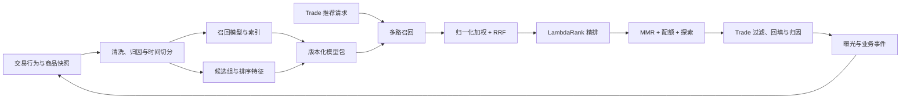
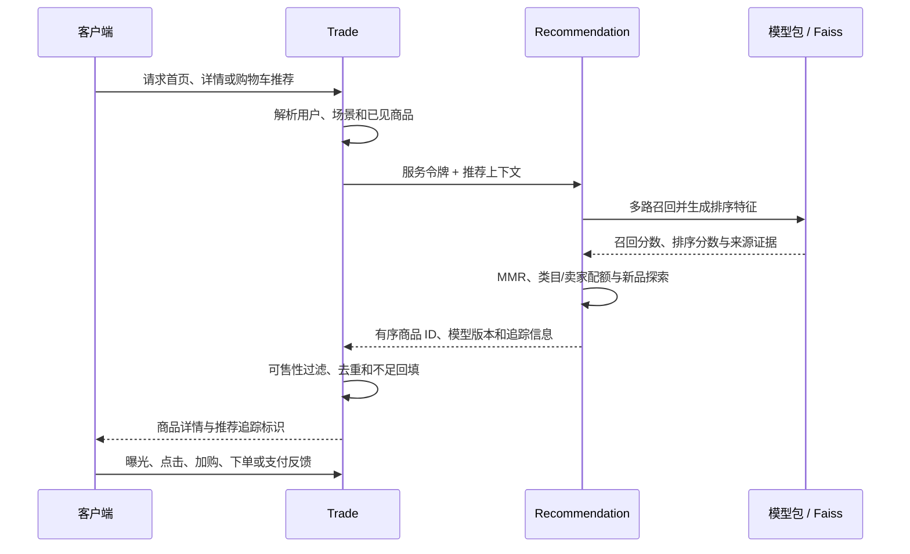

# LinkVerse 推荐系统设计

## 总体框架

当前推荐链路服务于 Trade 商品域。系统把候选生成、模型排序和业务交付分开：Recommendation 负责从模型与内容信号中产生有序商品 ID，Trade 负责身份上下文、可售性过滤、结果归因和异常降级。

离线训练的输入、字段和标签见[推荐数据与训练：数据来源](推荐数据与训练.md#数据来源)；各轮实测变化见[迭代与验证结果：推荐系统迭代](迭代与验证结果.md#推荐系统迭代)。

## 离线训练与候选构建

训练先按事件时间切分数据，再使用训练时间窗构建召回器和商品索引。排序样本不是直接把正负事件逐行交给模型，而是先为每个用户构建与线上一致的候选组，再计算候选级特征和相关性标签。这样可以减少“训练只看少量候选、线上却在更大候选池排序”造成的分布偏差。

当前冻结候选方案为每个训练组最多生成 **500** 个候选。这个数表示排序训练时的候选组规模，不等于线上接口的 `candidate_count`，也不等于 Recall@50 或 NDCG@20 中的评估截断位置。候选组、特征和指标口径见[推荐数据与训练：候选组与特征](推荐数据与训练.md#候选组与特征)和[推荐数据与训练：指标口径](推荐数据与训练.md#指标口径)。

## 在线推荐流程

Recommendation 不直接写 Trade 数据库，也不决定商品是否仍可售。Trade 会在交付前检查商品状态、库存和场景约束，并在推荐服务不可用、超时或结果不足时使用本地热门商品降级。

## 多路召回

| 召回通道 | 主要信号 | 作用 |
|---|---|---|
| 时间衰减热门 | 行为强度与事件新鲜度 | 为匿名用户、稀疏用户和异常降级提供稳定候选 |
| 新品召回 | 商品发布时间 | 增加新商品曝光，缓解只推荐历史热门商品的问题 |
| 加权 ItemCF | 用户共同交互与行为权重 | 捕获“看过或购买相似商品的人还关注什么” |
| 内容召回 | 标题、作者、描述与类目字符 TF-IDF | 在交互稀疏时利用商品文本相似性补充候选 |
| 双塔召回 | 用户向量与商品向量 | 学习行为与属性的隐式匹配，并通过 Faiss 检索候选 |

在线双塔索引采用归一化向量和 Faiss `IndexFlatIP`，在当前数据规模下执行精确内积检索。它优先保证实验可解释性和基线正确性；当数据规模需要近似检索时，再以召回损失、延迟和内存为依据选择 IVF 或 PQ 等索引。

## 候选融合

不同召回器的原始分数不可直接比较。系统先在通道内做最小—最大归一化，再按通道权重合并分数，并记录 Reciprocal Rank Fusion（RRF）证据。融合阶段同时保留候选来自哪些召回器、各通道排名和热门倒数排名，供精排模型使用。

当某个召回器无候选或分数范围退化时，融合逻辑会跳过无效归一化，避免单一通道异常破坏整个候选池。

## 精排

当前代码中的精排器使用 LightGBM LambdaRank，直接优化同一用户候选组内的相对顺序。服务兼容 v2 的 5 个基础特征和 v3 候选的 15 个特征；v3 新增双塔相似度、已知用户标志、融合分、融合分存在标志、热门倒数排名和五个召回来源标志。

模型包声明特征 Schema 版本和特征顺序。服务加载模型时会核对元数据，防止训练侧和在线侧特征错位。具体字段见[推荐数据与训练：候选组与特征](推荐数据与训练.md#候选组与特征)。

2026-09-08 的 15 维 v3 包只作为候选完成质量与工程验证，没有晋级；当次 18084 测试服务继续保留 2026-09-06 的 5 维 v2 工程包。仓库不包含模型权重，其他本地环境实际加载哪个版本取决于模型根目录的活动指针。

## 重排

精排之后使用 MMR 在相关性与多样性之间做折中，当前相关性系数为 `0.8`。结果还会执行单类目最多 6 个、单卖家最多 3 个的配额约束，并预留约 10% 的新品探索位置。

这些规则解决的是列表级问题：相关性模型可以把相似商品都排在前面，但用户最终看到的列表还需要覆盖不同类目、卖家和新商品。配额只调整顺序与入选集合，不改写模型原始分数。

## Trade 交付与反馈

Trade 根据场景补充用户上下文并完成以下业务处理：

1. 过滤下架、无库存、重复或当前场景不允许的商品。
2. 推荐结果不足时，以本地可售热门商品回填。
3. 为返回列表生成追踪标识，记录模型版本、位置和来源。
4. 接收曝光、详情、加购、下单、支付和退款事件，完成归因后形成后续训练样本。

业务事件的标签权重与成熟曝光规则见[推荐数据与训练：标签与负样本](推荐数据与训练.md#标签与负样本)。

## 模型发布与回滚

模型训练产物以版本化目录保存，包含模型文件、特征 Schema、训练摘要和评估结果。在线服务先在候选槽位加载并校验完整性，成功后再原子切换活动模型；加载失败时继续保留旧模型，避免半加载状态影响请求。

候选模型必须同时通过离线质量、延迟、稳定性和业务约束。2026-09-08 候选模型的离线指标明显改善，但 300 候选压测的 P95 超过门槛，因此没有切换为活动工程模型。详细结果见[迭代与验证结果：工程验证与候选状态](迭代与验证结果.md#工程验证与候选状态)。

## 与原推荐系统的关系

第二阶段推荐系统提供了 UserCF、ItemCF、双塔、三塔粗排、DCN、MMR、Faiss、FastAPI 和增量微调等设计基础。当前方案保留“召回—排序—重排—服务化”的主干，同时围绕第三阶段交易数据和可复现实验做了重构。第二阶段的原始说明见[RecommenderSystem 分支 README](https://github.com/1dream/KnowledgeLink/tree/RecommenderSystem#readme)。

### 第二阶段版本演进

| 版本 | 主要措施与升级 |
|---|---|
| v1.0 | 建立 UserCF、ItemCF、双塔、关键词/类目和内容聚类等多路召回；使用三塔粗排、多任务 MLP 精排及 CLIP 特征辅助的 MMR 重排 |
| v2.0 | 加入 LightGCN 召回，将精排升级为多任务 DCN，并优化 CLIP 特征计算的内存占用 |
| v3.0 | 引入 Faiss IVF-PQ 向量索引和超参数搜索，形成 CSV 预处理、模型加载、用户与时间上下文输入、有序 ID 输出的离线链路 |
| v4.0 | 使用 FastAPI 对外提供推荐接口，拆分数据库离线处理与在线推荐职责 |
| v4.1 | 增加按时间范围提取新增数据的微调入口，为增量更新模型提供基础 |

这些版本说明用于交代当前设计来源。第三阶段的实际训练迭代和结果见[迭代与验证结果：推荐系统迭代](迭代与验证结果.md#推荐系统迭代)。

| 方面 | 第二阶段方案 | 当前方案 |
|---|---|---|
| 数据入口 | CSV 与离线数据库读取，主要使用构造数据 | 旧 CSV 可迁移为 Parquet；新增 Trade 快照与事件清单、哈希和引用完整性校验 |
| 用户标识 | 业务用户 ID 直接参与处理 | HMAC 化用户 ID，数据清单记录来源与 Schema |
| 召回 | UserCF、ItemCF、双塔、关键词/类目和内容聚类 | 时间衰减热门、新品、加权 ItemCF、字符 TF-IDF 和双塔召回 |
| 粗排/精排 | 三塔粗排与多任务 DCN；后续引入 DCN 优化 | 多路融合直接构建候选证据，LightGBM LambdaRank 做候选组排序 |
| 特征契约 | 模型输入与服务输入耦合较紧 | 显式特征 Schema、模型包校验、候选槽加载和原子切换 |
| 评估 | 模型级指标与接口返回为主 | 时间切分、防泄漏检查、冻结基线、Bootstrap 区间、延迟门禁与可追溯归档 |
| 业务闭环 | 推荐服务独立提供有序 ID | Trade 负责可售过滤、回填、归因和反馈，模型不直接写业务库 |

升级的重点是让效果提升可以被同一数据口径复现，并让模型是否发布由质量与工程门禁共同决定。
