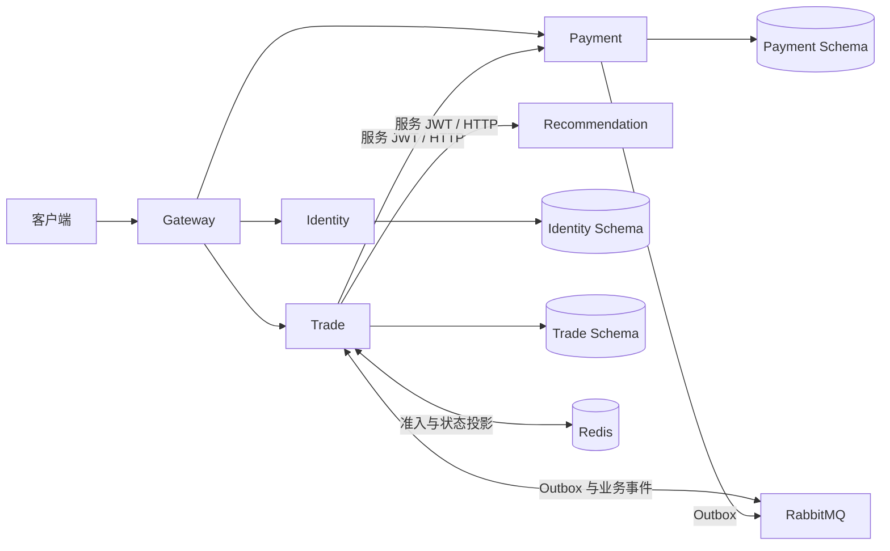

# LinkVerse 系统架构

## 总体架构

当前 LinkVerse 以 Gateway、Identity、Trade、Payment、Recommendation 五个部署单元组成交易与商品推荐闭环。Gateway、Identity、Trade、Payment 使用 Java 21 与 Spring 技术栈，Recommendation 使用 Python 3.12、FastAPI 和独立模型包。

## 技术选型

| 层次 | 当前使用 | 作用 |
|---|---|---|
| Java 服务 | Java 21、Spring Boot 3.5.15、Spring Cloud 2025.0.3、Spring Cloud Alibaba 2025.0.0.0 | 服务实现、路由、发现与配置 |
| 身份安全 | Spring Authorization Server、OAuth2 Resource Server、JWT | 用户身份、服务身份和内部接口授权 |
| 持久化 | MyBatis-Plus 3.5.17、Flyway、MySQL 8.4 | 业务数据、约束、事务和数据库迁移 |
| 缓存与消息 | Redis 8.2、RabbitMQ 4.3 | 限流、秒杀准入、状态投影和跨服务事件 |
| 推荐系统 | Python 3.12、FastAPI、PyTorch、Faiss、LightGBM、Optuna | 数据处理、模型训练、召回、排序和在线推断 |
| 验证工具 | JUnit 5、Testcontainers、WireMock、Toxiproxy、pytest、k6 2.2.0 | 单元、集成、故障和性能验证 |
| 可观测性 | Micrometer、结构化日志、请求 ID、对账和重放工具 | 请求定位、状态核验和异常恢复 |

依赖补丁版本由 Maven 父工程、中间件版本文件和 Python 锁文件统一管理。当前 Java 服务间同步调用使用 RestClient；RabbitMQ 是唯一消息代理。

## 服务与数据边界

### Gateway

负责统一 HTTP 入口、路由、JWT 预校验、请求 ID 和基础限流。资源服务仍会独立校验令牌，不以网关请求头作为身份事实。

### Identity

负责注册、登录、用户令牌和服务令牌。Identity 独占账号与认证数据，不向其他服务开放数据库表；其他服务通过 JWT 获得必要身份信息。

### Trade

负责商品、购物车、库存、普通订单、秒杀预约和交易侧状态。Trade 管理订单和库存事实，并负责对 Recommendation 返回的商品进行可售性过滤、交付归因和异常降级。

### Payment

负责支付 Intent、渠道回调、关单、退款补偿、支付事件和支付侧对账。Payment 独占支付记录，Trade 通过受认证的内部接口查询或改变支付状态。

### Recommendation

负责商品推荐的数据处理、离线训练、模型加载和在线推断。Python 只读取匿名快照和模型包，不写业务数据库；当前接入 Trade 域，Forum 域通过独立适配器扩展。

## 数据基准

订单、库存与支付等业务状态以 MySQL 记录为基准。Identity、Trade、Payment 分别拥有独立 Schema，即使本地共享同一 MySQL 实例，也不通过跨 Schema 写入或 Join 共享业务数据。

Redis 保存缓存、限流状态、秒杀准入库存和结果投影。它可以通过业务事实重建，不作为最终订单、库存或支付状态。RabbitMQ 负责传递已提交的业务事件，也不作为业务事实存储。

## 职责划分

- Gateway 管理统一入口，Identity 管理身份，Trade 管理商品交易，Payment 管理支付事实，Recommendation 管理推荐计算。
- 每个服务只通过公开契约访问其他服务的能力，不直接读写其他服务的数据表。

## 服务通信

- 同步 HTTP 用于调用方立即需要结果的内部查询和状态操作，例如创建或关闭支付 Intent、请求推荐候选。
- 异步事件用于传播已经提交的业务事实，例如支付成功、退款结果、秒杀请求和预约结果。
- Trade 与 Payment 各自在本地事务中写业务数据和 Outbox；消费者通过事件 ID 去重，事务提交后确认消息。

## 推荐边界

Recommendation 接收带服务身份的推荐请求，返回有序商品 ID、模型版本和追踪信息。它不写 Trade 数据库，也不决定商品能否交易。Trade 在交付前过滤下架、无库存和重复商品，结果不足时使用业务侧热门候选回填，并把后续行为归因到对应投递。

当前模型和数据只服务 Trade 商品域。Forum 接入时需要独立的领域适配器、数据集、标签、对象特征、索引和模型包，不能直接混用交易标签。

## 失败与恢复边界

- Payment 暂时不可用时，Trade 不猜测支付结果，由重试和对账恢复。
- Recommendation 不可用或超时时，Trade 返回数据库热门或新品候选，交易核心功能继续工作。
- Redis 或 RabbitMQ 不可用时暂停新增秒杀预约，普通订单仍由 MySQL 完成。
- Redis 投影丢失可根据 MySQL 预约与库存状态重建；消息失败通过有限重试、停车、重放和对账处理。

## 本地部署方式

默认脚本启动 MySQL、Redis、RabbitMQ、Nacos 四个容器，以及 Gateway、Identity、Trade、Payment 四个宿主机 Java 进程。Recommendation 使用可选 Compose profile 启动，模型目录以只读方式挂载。

具体命令见[运行与测试：环境准备与启动](运行与测试.md#环境准备与启动)。
