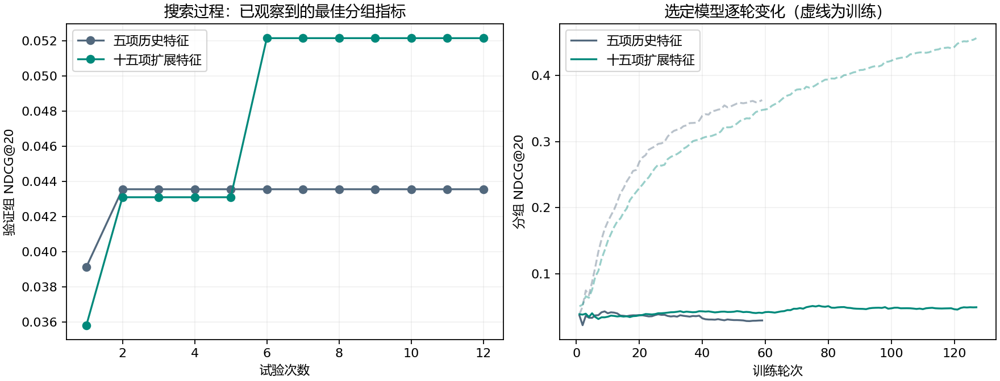
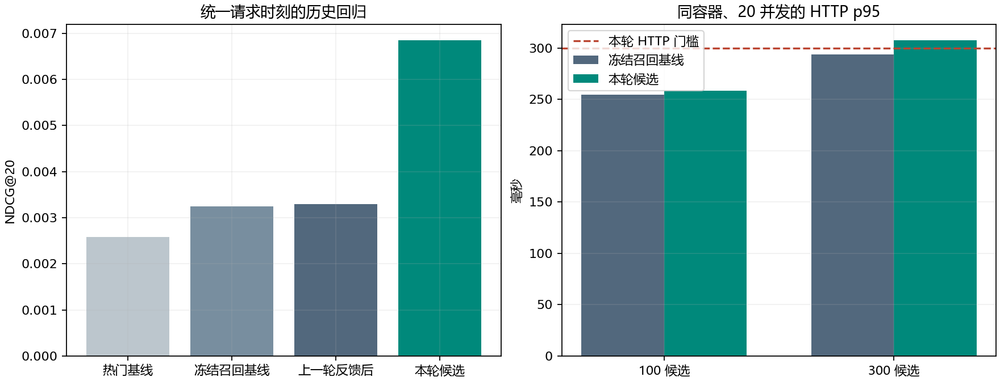

# 2026-09-08 精排候选对齐升级总结

状态：训练、校准、历史复评、Linux HTTP 与性能测试完成。保留独立候选包和全过程指标；当前业务工程模型未替换。

## 已确认的改进

相对上一轮正式反馈后模型，本轮历史 NDCG@20 提升 107.7%，Recall@50 提升 29.6%。覆盖率下降 4.10 个百分点，相对下降 5.5%。

测试固定 7,581 个用户，其中 7,541 个可评估；所有模型使用相同商品目录、公共历史排除与 2026-02-26T15:13:00Z 请求时刻。

| 模型 | NDCG@20 | Recall@50 | HitRate@20 | 覆盖率@20 | 短列表 / 类目违规 |
|---|---:|---:|---:|---:|---:|
| 热门与配额 | 0.002586 | 0.015221 | 0.011404 | 0.40% | 0 / 0 |
| 冻结召回基线 | 0.003242 | 0.034151 | 0.014189 | 76.88% | 0 / 0 |
| 上一轮反馈后 | 0.003299 | 0.038271 | 0.014454 | 74.88% | 0 / 0 |
| 本轮候选 | 0.006853 | 0.049611 | 0.025328 | 70.78% | 0 / 0 |

本轮与上一轮反馈后模型的配对 NDCG 差值为 0.003554，2,000 次用户 bootstrap 的 95% 区间为 [0.002119，0.004963]。与冻结召回基线、热门基线的区间也为正。区间反映已查看的合成历史样本，不属于确认性盲测，更不能换算成真实 CTR 或成交提升。

以下按冻结召回基线固定人群成员比较，避免词表变化混淆分母；冷启动样本量不足以做稳定收益结论。

| 固定人群 | 可评估用户 | 基线 NDCG@20 | 候选 NDCG@20 |
|---|---:|---:|---:|
| 冷启动 | 10 | 0.000000 | 0.027024 |
| 稀疏 | 763 | 0.002646 | 0.007649 |
| 活跃 | 6,768 | 0.003314 | 0.006734 |

## 实际升级内容

- 在线和训练共用候选生成、补位、历史过滤和特征入口，训练组由最多五个对象扩大到本轮实际 500 个对象。未召回目标不注入候选池，召回失败仍进入完整列表评估分母。
- 精排从五项历史特征扩展到十五项，补入双塔相似度、融合召回分数、缺失标记、热门名次和来源；旧精排分数不作为召回相关性输入。
- 新特征 Schema 与 MMR 策略写入模型包，维度或顺序错误拒绝加载，旧包维持原策略；额外提供同分平均名次百分位和有界缩放。
- 新增冻结召回的精排训练入口、验证窗口尺度校准入口，以及统一请求时刻的评估版本 5 和数据摘要/时间防泄漏检查。

## 训练与选择经过

召回包训练截止为 2026-02-06T12:34:00Z。精排训练从 2026-02-06T13:13:00Z 起，使用至 2 月 20 日之前的成熟标签；验证使用 2 月 20 日至 2 月 26 日 15:13Z 之前的成熟标签。双塔、索引和召回池均冻结，没有重复双塔搜索。

正式训练有 4,644 个可评估用户，1,358 个可拟合候选组、679,000 个候选行和 1,461 个正标签行；验证覆盖 2,747 个用户，其中 716 个组命中目标。大量候选行不等于大量独立真实反馈。

五项与十五项特征各完成 12 次搜索，共 24 个 trial，正式过程记录 1,987 条逐轮指标。五项特征最佳为 9 棵树，十五项为 77 棵树。完整参数、训练曲线和特征增益见正式运行目录。

首次扩展特征验证 NDCG 为 0.008590，但覆盖率 52.60% 低于门槛 54.31%，正式选择保留基线。随后仅在验证集追加 0.25 / 0.50 / 0.75 三档尺度校准，保留该失败记录且不修改门槛。0.25 档以 NDCG 0.008190、覆盖率 54.93% 达标，模型摘要随即冻结，之后才查看候选测试结果。

三个固定种子的完整历史 NDCG 为 0.006853 / 0.005750 / 0.006285，均值 0.006296，总体标准差 0.000451。首种子在验证组上的重复预测最大差为 0；种子间有波动，没有依据测试结果更换种子或重选模型。

## 接口、容量与性能

47 项最终 Python 测试通过。对上一轮归档代码的旧包兼容性为 135/135；最终 Linux 容器与 Windows 的 HOME / DETAIL / CART、已知 / 冷启动、100 / 300 候选响应为 180/180 一致。额外 100 次并发换版请求有效，20 次越界指针请求保留已加载包，非法令牌返回 401。

首次隔离 HTTP 运行失败：测试夹具的冷启动键未符合 64 位匿名哈希格式，且全量模型热切换把 2GiB 容器内存占满，块 I/O 显著增长，出现读取超时；未采集独立 swap 计数，不将换页推断当成实测。失败日志保留。夹具修正后在明确的 6GiB、4 CPU 容器复测通过，三次激活/回滚约 20.94 / 22.25 / 20.03 秒，包含调用方包校验与服务端加载，不能引用上一轮小目录约 1 秒换版作为全量指标。

性能采样在离线任务完成后开始，同一镜像、容器、CPU/内存限制与直连配置分别测基线和候选。每档预热 15 秒、采样 60 秒；持续负载采样 120 秒并加入 1 秒思考时间。全量目录 6,262 个商品，10 个已知与 10 个冷启动虚拟用户。持续负载不是 30 分钟长稳验收。

| 场景 | 请求数 | 有效模型率 | p95 / ms | p99 / ms | RPS | 本档门禁 |
|---|---:|---:|---:|---:|---:|---|
| before-100-vu20 | 7,231 | 100.00% | 254.3 | 1569.9 | 120.5 | 通过 |
| before-300-vu20 | 6,040 | 100.00% | 293.5 | 1636.9 | 100.7 | 通过 |
| after-100-vu20 | 6,719 | 100.00% | 258.1 | 1605.5 | 112.0 | 通过 |
| after-300-vu20 | 5,505 | 100.00% | 307.6 | 1636.4 | 91.8 | 未通过 |
| after-sustained-vu20 | 2,266 | 100.00% | 89.3 | 214.2 | 18.9 | 通过 |

正常 HTTP 采样共 27,761 次请求。候选进程内复测三次各 2,000 调用，20 并发、300 候选，p95 为 166.1 / 175.8 / 175.9ms；它与 HTTP p95 分开解释。HTTP 使用本轮保守的 300ms 门槛，ADR 原始 300ms 指进程内推断。

## 过程资源

| 阶段 | 资源采样数 | 本机 RSS 采样峰值 / GiB | 容器内存采样峰值 / GiB | 容器可用 / 失败 / 未返回 |
|---|---:|---:|---:|---:|
| 正式训练及初始回归 | 93 | 6.839 | 0.454 | 87 / 0 / 6 |
| 尺度校准及种子复现 | 19 | 3.439 | 1.724 | 17 / 0 / 2 |
| 6GiB 容器换版验证 | 20 | 4.996 | 3.764 | 17 / 0 / 3 |
| 候选 HTTP 测试 | 58 | 0.079 | 1.884 | 58 / 0 / 0 |

容器与本机 Python 是不同进程，内存值不可直接相加为单个模型占用。训练阶段的容器数值还可能包含保持运行的原服务，逐条原始记录保留容器名。部分采样在前置命令超时等异常后没有返回容器状态，单独计为未返回，不补零。本轮精排在 CPU 训练，GPU 记录是整卡观察，主要来自其他本机应用，不能声称是本轮训练分配的显存。

## 是否晋级

历史离线质量门禁：通过；候选 HTTP 综合门禁：未通过。最终用途保持 ENGINEERING；合成候选未接入真实业务商品目录，没有自然用户收益证据。当前 18084 服务保持上一轮本地工程包 `trade-20260906084521028172-6f240414-670bd78a`。

候选模型：`trade-20260908070431966489-6f240414-4f63f5f4`；manifest SHA256：`5de0c519409309db7a59edc64fdff2127979204cf837e2a052adaed738542a93`。模型在测试后未改写，决策绑定该摘要。

## 后续优先完善的工作

1. 建立新的自然流量或独立未来时间窗，按请求记录曝光、成熟点击/支付/退款及未点击曝光；沿用归因链和成熟边界，真实数据不能复用本轮把未观察候选标成零的合成负例路径。
2. 保持候选和业务配额，减少特征提取与 HTTP 请求路径成本；用剖析证据决定优化点，并为全量热加载明确内存预算。大量预计算 JSON 候选表的加载和双包共存是已观测到的容量问题。
3. 扩大冷启动与不同活跃度样本，持续报告固定人群和种子方差；覆盖率接近门槛，应同时跟踪卖家触达和曝光集中度。达到真实质量、运行和回滚门槛后再评审晋级。

## 复现步骤与证据

1. 保存数据、模型与源码摘要，确认 Docker、推荐 Python 环境和原模型包可用。
2. 使用独立输出目录执行 `python -m linkverse_recommendation.training.ranker_iteration --config <正式配置>`；完整配置见正式运行的 `config.json`。
3. 需要复现本轮校准时，执行 `python -m linkverse_recommendation.training.ranker_calibration --config <校准配置>`；输入是正式运行的冻结特征和树模型。
4. 用归档 `final-evaluate.py` 在共同请求时刻复评，并保留所有种子的结果；禁止据测试结果调整参数。
5. 使用归档 Dockerfile 构建隔离镜像，6GiB / 4 CPU 运行，执行 `check-runtime.py` 和 `run-performance.ps1`；新运行必须改输出目录和容器名。
6. 汇总逐轮、逐请求、资源和失败记录；核对模型及运行源码摘要，生成晋级决策，再清理本轮测试容器。

本轮没有修改依赖或 Java 业务代码，未新增业务反馈夹具或数据库结构变更；Identity 令牌请求正常经过本地服务。没有重跑 Java 或完整端到端支付反馈闭环。两个用户原有修改文件的摘要保持不变。首次失败、旧评估口径和正式阶段保留基线的选择均保留，不覆盖旧报告。

证据目录：`../runs/trade-ranker-final-evidence-20260908/`，包含资源摘要、镜像与源码身份、晋级决策、图表、脚本和运行索引；各运行目录保留原始数组、用户/请求记录和源码 ZIP。
